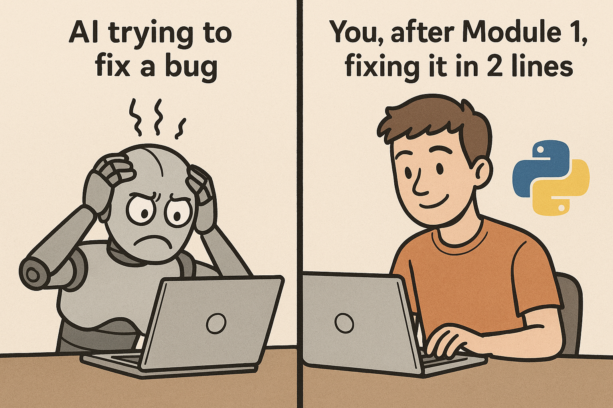

.. Python for AI Users documentation master file, created by
   sphinx-quickstart on [Date].
   You can adapt this file completely to your liking, but it should at least
   contain the root `toctree` directive.

====================================================
Python for AI Users: Code Smarter, Not Harder
====================================================

Welcome! Stop wrestling with AI-generated code. This guide is designed to empower you with the fundamental Python skills necessary to take control, effectively leverage, and collaborate with AI in your coding endeavors.

In an era where AI significantly augments development workflows, a solid understanding of core programming concepts remains invaluable. Many individuals find themselves hitting roadblocks when relying solely on AI-generated code, struggling to debug or extend solutions beyond the AI's immediate capabilities. Often, the "fix" is straightforward for someone with basic coding literacy.

This course bridges that gap. It's crafted for:

*   **Aspiring AI Collaborators:** Individuals who want to use AI tools more effectively by understanding the code they generate.
*   **Non-Programmers Venturing into AI-Powered Development:** Those looking to build applications with AI assistance but need the foundational Python knowledge to guide, troubleshoot, and customize.
*   **Anyone Seeking to Enhance Their "Vibe Coding" with Real Skills:** If you're excited about the potential of AI in coding but want to ensure you're building on a strong foundation, this course is for you.

Our goal is not just to teach you Python syntax, but to equip you with the thinking and problem-solving skills that make you a more capable and independent developer, even when working alongside powerful AI tools.

--------------------
Course Navigation
--------------------

This course will guide you systematically through the essentials of Python programming:

.. toctree::
   :maxdepth: 2
   :caption: Course Modules:

   module0_getting_started
   module1_variables_and_data_types
   module2_control_flow
   module3_data_structures_lists_tuples
   module4-data-structures-dictionaries-sets
   module5_functions
   module6_error_handling_exceptions
   module7_file_io
   module8_modules_packages
   module9_oop_intro
   module10_vibe_coding
   module11_practical_llm_interaction

.. note::
   As you progress, you'll find mini-projects in each module designed to reinforce your learning and help you apply these concepts in practical ways. We believe in learning by doing!

We are excited to have you on this learning journey. Let's unlock the full potential of Python and AI, together!