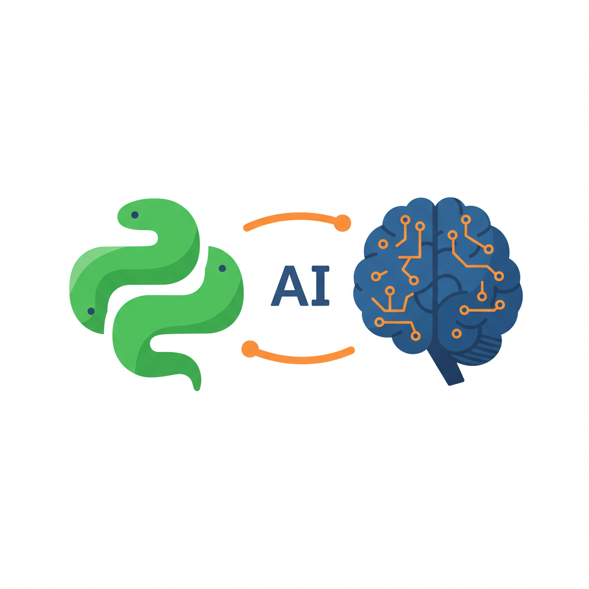

.. _module11-practical-llm-interaction:

======================================================
Module 11: Practical LLM Interaction with `lollms-client`
======================================================

Welcome to Module 11! After learning the theoretical underpinnings of Large Language Models and how they can assist in coding (Module 10), it's time to get hands-on. In this module, we will use the `lollms-client` Python library to programmatically interact with LLMs. `lollms` (Lord of Large Language Models) is an open-source project that provides a UI and backend for managing and interacting with various LLMs, and `lollms-client` allows us to tap into that power from our Python scripts.

This module will focus on sending prompts, receiving responses, and exploring how to integrate LLM assistance into simple Python workflows. We'll also touch upon how such a client can be a gateway to multi-modal AI if the backend `lollms` instance is configured with capable models.



**Important Prerequisite:**
To follow along with the practical examples in this module, you will need:
1.  **A running instance of `lollms`:** This could be `lollms-webui` running locally on your machine or a remote `lollms` server you have access to. Ensure it's configured with at least one text-generation model (personality).
2.  **The `lollms-client` library installed:** `pip install lollms-client`

Learning Objectives
-------------------

By the end of this module, you will be able to:

*   Understand the role of a client library like `lollms-client` for LLM interaction.
*   Install and configure `lollms-client` to connect to a `lollms` instance.
*   Send text prompts to an LLM via `lollms-client` and receive generated text/code.
*   Handle different types of responses and stream output.
*   Use `lollms-client` for practical coding assistance tasks like:
    *   Generating Python functions from descriptions.
    *   Explaining code snippets.
    *   Suggesting debugging solutions.
*   Understand how to list available models/personalities and select specific ones.
*   Briefly explore concepts for interacting with multi-modal models if your `lollms` setup supports them (e.g., sending an image URL for description or analysis).
*   Appreciate the iterative nature of prompting and refining AI interactions programmatically.

----------------------------------------------------

What is `lollms` and `lollms-client`?
=====================================

**`lollms` (Lord of Large Language Models):**
*   An open-source project designed to be a versatile platform for interacting with a wide array of Large Language Models.
*   It provides a web interface (`lollms-webui`) for chatting, managing models, and configuring "personalities" (pre-configured prompts and settings for specific tasks).
*   It supports various LLM backends, including local CPU/GPU inference engines (like llama.cpp, CTransformers) and connections to remote APIs.
*   The core idea is to offer a unified way to access different LLMs and their capabilities.

**`lollms-client`:**
*   A Python library that acts as a client to a running `lollms` instance (either local or remote).
*   It allows your Python scripts to send requests (prompts) to the `lollms` backend and receive the LLM's responses.
*   This enables programmatic control over LLM interactions, which is essential for integrating AI assistance into automated workflows, tools, or applications.

**Why use `lollms-client`?**
*   **Unified Interface:** If your `lollms` backend is configured with multiple models, you can switch between them via the client.
*   **Local LLM Access:** It's a great way to interact with LLMs running locally on your machine, offering more privacy and control.
*   **Flexibility:** Allows you to build custom applications or scripts that leverage the power of LLMs managed by `lollms`.
*   **Extensibility:** `lollms` is designed to be extensible with new bindings and services.

----------------------------------------------------

Setting Up `lollms-client`
==========================

**1. Installation:**
   If you haven't already, install the library using pip:
   .. code-block:: bash

       pip install lollms-client

**2. Ensure `lollms` is Running:**
   Before using `lollms-client`, you need a `lollms` instance running and accessible.
   *   **Local `lollms-webui`:** Start your local `lollms-webui`. By default, it usually runs on `http://localhost:9600`.
   *   **Remote `lollms` Server:** If you are connecting to a remote server, you'll need its address (host and port).

**3. Basic Connection and Client Initialization:**
   The client needs to know the address of the `lollms` server.

   .. code-block:: python
       # basic_connection.py
       from lollms_client import LollmsClient

       # Default host and port for a local lollms-webui instance
       LOLLMS_HOST = "localhost"
       LOLLMS_PORT = 9600

       try:
           # Initialize the client
           # For a remote server, use: client = LollmsClient("your_remote_host", your_remote_port)
           client = LollmsClient(LOLLMS_HOST, LOLLMS_PORT)
           print(f"Successfully connected to lollms server at {LOLLMS_HOST}:{LOLLMS_PORT}")

           # You can try a simple health check or get server status
           # (Specific methods might vary based on client library version,
           #  refer to lollms-client documentation for exact API endpoints if needed)
           # For now, a successful initialization is a good sign.

       except ConnectionRefusedError:
           print(f"Error: Connection refused. Ensure lollms server is running at {LOLLMS_HOST}:{LOLLMS_PORT}.")
       except Exception as e:
           print(f"An unexpected error occurred: {e}")

   *Note: The exact methods for health checks or getting server status might change. The primary goal here is successful client initialization.*

----------------------------------------------------

Sending Prompts and Receiving Responses
=======================================

The core functionality is to send a prompt to a selected LLM "personality" and get a response.

Listing Available Personalities/Models
--------------------------------------
Before generating, you might want to know what models or personalities are available on your `lollms` server.

.. code-block:: python
    # list_personalities.py
    from lollms_client import LollmsClient, PromptBuilder

    LOLLMS_HOST = "localhost"
    LOLLMS_PORT = 9600

    try:
        client = LollmsClient(LOLLMS_HOST, LOLLMS_PORT)
        print("Fetching available personalities...")
        personalities = client.list_personalities() # This is a common expected function

        if personalities:
            print("\nAvailable Personalities/Models:")
            for i, p in enumerate(personalities):
                # The structure of 'p' might vary, it could be a dict or a string.
                # Assuming 'p' is a dictionary with 'name' and 'category' (adjust if different)
                if isinstance(p, dict):
                    print(f"  {i+1}. {p.get('name', 'Unknown Name')} (Category: {p.get('category', 'N/A')})")
                else:
                    print(f"  {i+1}. {p}") # If it's just a list of names
        else:
            print("No personalities found or error fetching them. Ensure lollms has mounted personalities.")

    except ConnectionRefusedError:
        print(f"Error: Connection refused. Ensure lollms server is running at {LOLLMS_HOST}:{LOLLMS_PORT}.")
    except Exception as e:
        print(f"An error occurred: {e}")
        print("Please check if the lollms server is responsive and has personalities mounted.")
        print("The `list_personalities()` method or its output structure might vary based on `lollms-client` version.")

*Actual method names like `list_personalities()` and the structure of their return values can depend on the specific version of `lollms-client` and the `lollms` backend. Always refer to the official `lollms-client` documentation or examples for the most up-to-date API usage.*

Simple Text Generation
----------------------
Let's send a prompt and get a simple text response. You'll typically need to specify which model/personality to use.

.. code-block:: python
    # simple_generation.py
    from lollms_client import LollmsClient, GenerationPresets

    LOLLMS_HOST = "localhost"
    LOLLMS_PORT = 9600
    # IMPORTANT: Replace with a personality name you have active in your lollms setup
    # You can find this by running list_personalities.py or checking your lollms-webui
    TARGET_PERSONALITY = "GPT4All" # Example: "GPT4All", "LlamaCpp_Python_Coder", "OpenAI" etc.

    try:
        client = LollmsClient(LOLLMS_HOST, LOLLMS_PORT)

        prompt_text = "Explain the concept of Object-Oriented Programming in 3 sentences."
        print(f"\nSending prompt to personality '{TARGET_PERSONALITY}':\n{prompt_text}\n")

        # The `generate_text` method is a common pattern.
        # Parameters might include: prompt, personality_name, max_tokens, temperature, etc.
        # `GenerationPresets` can be used if the client library supports it for common settings.
        # For simplicity, we'll assume a direct generation method.
        # If the client requires explicit personality selection beforehand, that step would be needed.

        # Check if the personality is mounted
        mounted_personalities = client.list_mounted_personalities()
        if not any(p['name'] == TARGET_PERSONALITY for p in mounted_personalities if isinstance(p,dict)):
             print(f"Personality {TARGET_PERSONALITY} is not mounted. Please mount it in lollms and try again.")
        else:
            # A common way is to select personality then generate
            # This is a hypothetical structure, adapt based on actual lollms-client API
            # client.select_personality(TARGET_PERSONALITY) # Or similar method
            
            # The actual generation call might look like this (consult lollms-client docs):
            # response = client.generate(prompt_text, max_new_tokens=150)
            # OR, if it's tied to a specific personality object or session:
            
            # Assuming a generate_text_with_personality method for clarity
            # This is a placeholder for the actual method.
            # You might need `client.generate(prompt, max_tokens, model=TARGET_PERSONALITY)`
            # or similar.
            
            # Let's use a more direct approach if available or simulate the expected interaction
            # The actual method might be `client.generate_text(prompt, personality_index, callback=None)`
            # or `client.generate(prompt, model_name, ...)`
            
            # For lollms-client, a common pattern is:
            # 1. Ensure the personality is selected/mounted. The client often uses the *currently selected* personality in the lollms-webui or the one set via API.
            # If you need to select it programmatically:
            # client. আব্দPOINT_MOUNT_PERSONALITY(TARGET_PERSONALITY) # replace with actual endpoint call

            # The generate function might be simpler if a personality is globally selected in lollms:
            print(f"Generating response using currently selected personality in lollms (ideally {TARGET_PERSONALITY})...")
            
            # Simplified generic call - you'll need to adapt this to the *exact* `lollms-client` method.
            # A common `lollms-client` pattern for text generation with streaming:
            full_response = ""
            def callback_function(chunk, type):
                nonlocal full_response
                # type can be 'chunk', 'header', 'footer', etc.
                if type == "chunk":
                    print(chunk, end="", flush=True)
                    full_response += chunk
                elif type == "footer": # End of generation
                    print("\n--- End of Generation ---")

            # This is a common way to call generation with callback
            # The specific method might be `client.generate_text(prompt_text, personality_name_or_index, callback_function, ...)`
            # Or, if the personality is pre-selected:
            # `client.generate_text(prompt_text, callback_function, max_new_tokens=250)`
            # The actual API might involve `client.start_generation(prompt, personality_name)` and then polling or using websockets.

            # Given the direct nature of `lollms-client`, let's assume a blocking call for simplicity first,
            # then show streaming.
            
            print(f"Attempting to generate text using personality: {TARGET_PERSONALITY}")
            # Find the index of the personality
            # personality_index = -1
            # personalities = client.list_personalities()
            # for i, p_info in enumerate(personalities):
            #     if p_info.get("name") == TARGET_PERSONALITY:
            #         personality_index = i
            #         break
            
            # if personality_index == -1:
            #     print(f"Error: Personality '{TARGET_PERSONALITY}' not found in the list.")
            # else:
            #     print(f"Found personality '{TARGET_PERSONALITY}' at index {personality_index}.")
            #     response_text = client.generate_text(prompt_text, personality_index) # Blocking call
            #     print("\nLLM Response (Blocking):")
            #     print(response_text)

            # More commonly, for streaming with lollms_client, you provide a callback:
            print("\nLLM Response (Streaming):")
            client.generate_text(
                prompt_text,
                personality_name=TARGET_PERSONALITY, # Pass personality name directly
                callback=callback_function,
                max_new_tokens=200 # Example parameter
            )
            # The full_response variable will be populated by the callback

    except ConnectionRefusedError:
        print(f"Error: Connection refused. Ensure lollms server is running at {LOLLMS_HOST}:{LOLLMS_PORT}.")
    except Exception as e:
        print(f"\nAn error occurred: {e}")
        print("Please ensure your `lollms` server is running, the specified personality is available and mounted,")
        print("and the `lollms-client` library is correctly installed and used.")
        print("The exact method calls (`generate_text`, `list_personalities`, etc.) and their parameters")
        print("can vary. Consult the `lollms-client` documentation for specific usage.")

**Important notes on the code above:**
*   **`TARGET_PERSONALITY`:** This is crucial. You *must* replace `"GPT4All"` or any placeholder with the actual name of a personality that is active and working in your `lollms` setup. You can find this from `lollms-webui` or the output of `list_personalities.py`.
*   **Actual Method Names and Parameters:** The `lollms-client` API (method names like `generate_text`, parameters like `personality_name` or `personality_index`, `max_new_tokens`) can evolve. **Always refer to the official `lollms-client` documentation or its GitHub examples for the most current usage.** The code provided here is based on common patterns but may need adjustment.
*   **Streaming (`callback`):** LLMs often generate text token by token. A callback function allows you to process the response as it arrives (streaming) rather than waiting for the entire thing. This is better for user experience in interactive applications. The `lollms-client` typically supports this.
*   **Error Handling:** Robust error handling is key, especially for network-dependent operations.

Streaming Output
----------------
The `callback_function` in the example above demonstrates streaming. Each `chunk` received is printed immediately. This is how tools like ChatGPT show text appearing gradually.

```python
# (Inside the try block of simple_generation.py or a new script)

# ... client initialization ...
# ... TARGET_PERSONALITY defined ...

prompt_for_code = "Write a Python function that takes a list of numbers and returns their sum."

def code_stream_callback(chunk, type):
    """Callback to handle streamed code output."""
    if type == "chunk":
        print(chunk, end="", flush=True)
    elif type == "footer":
        print("\n--- Code generation complete ---")

print(f"\nRequesting Python code from '{TARGET_PERSONALITY}':\n{prompt_for_code}\n")
client.generate_text(
    prompt_for_code,
    personality_name=TARGET_PERSONALITY,
    callback=code_stream_callback,
    max_new_tokens=300 # Allow more tokens for code
)
```

----------------------------------------------------

Practical Coding Assistance Examples
====================================

Let's try a few common coding assistance tasks.

1.  **Generating a Python Function:**
    (This was demonstrated in the "Streaming Output" section above.)
    Key: A clear, specific prompt describing the function's purpose, inputs, and outputs.

2.  **Explaining Code Snippets:**
    .. code-block:: python
        # explain_code.py
        from lollms_client import LollmsClient

        LOLLMS_HOST = "localhost"
        LOLLMS_PORT = 9600
        TARGET_PERSONALITY = "GPT4All" # Replace with your active personality

        client = LollmsClient(LOLLMS_HOST, LOLLMS_PORT)

        code_to_explain = """
        def factorial(n):
            if n == 0:
                return 1
            else:
                return n * factorial(n-1)
        """
        prompt = f"Explain the following Python code snippet in simple terms:\n\n```python\n{code_to_explain}\n```"

        print(f"\nAsking '{TARGET_PERSONALITY}' to explain code:\n")
        
        def explanation_callback(chunk, type):
            if type == "chunk":
                print(chunk, end="", flush=True)
            elif type == "footer":
                print("\n--- Explanation complete ---")
        
        try:
            client.generate_text(
                prompt,
                personality_name=TARGET_PERSONALITY,
                callback=explanation_callback,
                max_new_tokens=250
            )
        except Exception as e:
            print(f"Error during generation: {e}")

3.  **Suggesting Debugging Solutions:**
    .. code-block:: python
        # debug_assist.py
        from lollms_client import LollmsClient

        LOLLMS_HOST = "localhost"
        LOLLMS_PORT = 9600
        TARGET_PERSONALITY = "GPT4All" # Replace!

        client = LollmsClient(LOLLMS_HOST, LOLLMS_PORT)

        buggy_code = """
        def calculate_average(numbers):
            total = sum(numbers)
            return total / len(numbers) # Potential bug if numbers is empty

        my_list = []
        # average = calculate_average(my_list) # This will cause ZeroDivisionError
        # print(f"Average: {average}")
        """
        error_message = "ZeroDivisionError: division by zero" # Simulate the error

        prompt = f"""
        I have the following Python code:
        ```python
        {buggy_code}
        ```
        When I run it with `my_list = []`, I get this error:
        `{error_message}`

        What is causing this error and how can I fix it? Provide the corrected code.
        """
        print(f"\nAsking '{TARGET_PERSONALITY}' for debugging help:\n")

        def debug_callback(chunk, type):
            if type == "chunk":
                print(chunk, end="", flush=True)
            elif type == "footer":
                print("\n--- Debugging suggestion complete ---")
        
        try:
            client.generate_text(
                prompt,
                personality_name=TARGET_PERSONALITY,
                callback=debug_callback,
                max_new_tokens=400
            )
        except Exception as e:
            print(f"Error during generation: {e}")

**Tips for these tasks:**
*   **Context is Key:** The more relevant context you provide (code, errors, what you're trying to achieve), the better the LLM's response will be.
*   **Be Specific:** "Write a function" is vague. "Write a Python function that takes a string and returns True if it's a palindrome, False otherwise" is much better.
*   **Iterate:** If the first response isn't perfect, refine your prompt or ask follow-up questions.

----------------------------------------------------

Exploring Multi-Modal Capabilities (Conceptual)
===============================================

`lollms` aims to support multi-modal models (those that can process different types of data, like text and images). If your `lollms` backend has a multi-modal personality mounted (e.g., a model like LLaVA or an API connection to GPT-4 Vision):

*   **Sending Image Data:** The `lollms-client` would need a way to send image data. This could be:
    *   A URL to an image.
    *   A base64 encoded string of the image.
    *   A path to a local image file (the client or server would handle loading it).
*   **Prompting with Images:** Your prompt would then reference the image.

**Hypothetical Example (syntax will depend on `lollms-client`'s actual multi-modal API):**

.. code-block:: python
    # conceptual_multimodal.py
    # THIS IS HYPOTHETICAL - actual API will vary!
    from lollms_client import LollmsClient

    # Assume client is initialized and a multi-modal personality is selected/available
    # client = LollmsClient("localhost", 9600)
    # MULTIMODAL_PERSONALITY = "LLaVA_Personality" # Example

    # image_path_or_url = "path/to/your/image.jpg" # Or "http://example.com/image.jpg"

    # prompt_with_image = "Describe what you see in the provided image."
    # prompt_for_code_from_image = "This image shows a user interface mockup. Generate HTML and CSS for this layout."

    # def multimodal_callback(chunk, type):
    #     if type == "chunk":
    #         print(chunk, end="", flush=True)
    #     elif type == "footer":
    #         print("\n--- Multi-modal response complete ---")

    # try:
    #    Actual method to send image and text prompt:
    #    client.generate_with_image(
    #        prompt_with_image,
    #        image_data=image_path_or_url, # Or specific parameter for image
    #        personality_name=MULTIMODAL_PERSONALITY,
    #        callback=multimodal_callback,
    #        max_new_tokens=300
    #    )
    # except Exception as e:
    #    print(f"Error (conceptual multimodal): {e}")
    #    print("Note: This is a conceptual example. Check lollms-client for actual multi-modal API.")

**To make this practical:**
1.  Your `lollms` installation must have a multi-modal model correctly configured and mounted as a personality.
2.  The `lollms-client` library must have implemented methods for sending image data along with text prompts to such personalities. You would need to consult its documentation for the exact functions and parameters.

The ability to process images and relate them to code (e.g., "generate code for this UI diagram") is a very powerful emerging capability.

----------------------------------------------------

Iterative Prompting and Refinement
==================================

Remember, interacting with LLMs is often a dialogue.
*   **Start Simple:** Get a basic version working.
*   **Add Constraints:** "Now, can you modify that function to also handle edge cases X and Y?"
*   **Ask for Improvements:** "Is there a more Pythonic way to write this?" or "Can you add comments to this code?"
*   **Correct Mistakes:** If the LLM makes an error, point it out clearly and provide the correct information if you know it.

Programmatic interaction with `lollms-client` allows you to build these iterative loops into your scripts if needed, perhaps by chaining prompts based on previous outputs.

----------------------------------------------------

Module 11 Summary
=================

In this module, you've taken the first practical steps into AI-assisted development by learning how to use `lollms-client` to communicate with Large Language Models. Key achievements:

*   Understood the client-server architecture with `lollms` and `lollms-client`.
*   Practiced connecting to a `lollms` instance and listing available personalities.
*   Successfully sent prompts and received (streamed) text and code responses.
*   Applied these interactions to common coding assistance tasks: function generation, code explanation, and debugging help.
*   Gained a conceptual understanding of how multi-modal interactions might work.

The most crucial takeaway is that effective LLM interaction is a skill. It involves clear communication (prompting), critical evaluation of the output, and an iterative refinement process. `lollms-client` provides a powerful tool to integrate these AI capabilities directly into your Python projects.

**What's Next? Building with AI!**
Now that you can communicate with an AI, the next step is to build something more substantial where the AI plays a specific, helpful role. In the final module of this introductory series, we'll aim to conceptualize and (time/scope permitting) partially implement a small project that leverages `lollms-client` for a defined purpose. This will bring together your Python skills and your new "Vibe Coding" abilities.

Get ready to apply your knowledge in :ref:`module12-building-ai-assisted-app`!