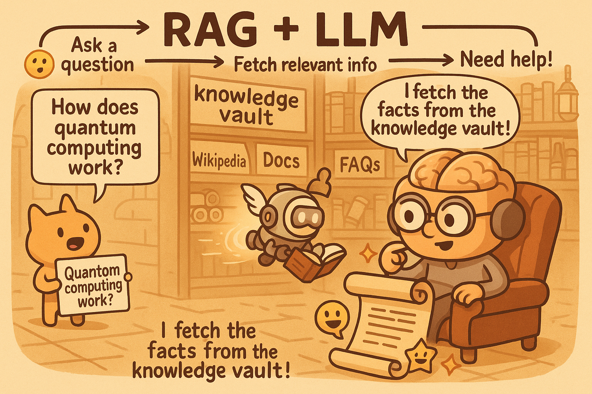

.. _module12-rag-graphrag-safestore:

=============================================================================================
Module 12: Smarter LLMs: Retrieval Augmented Generation (RAG) and GraphRAG with `safe_store`
=============================================================================================

Welcome to Module 12! In our journey so far, we've explored basic LLM interactions and advanced orchestration with `lollms-client`. Now, we address a fundamental limitation of Large Language Models: their knowledge is typically frozen at the time of training and they lack access to specific, private, or real-time information. This module introduces **Retrieval Augmented Generation (RAG)**, a powerful technique to overcome this by providing LLMs with external knowledge.

We'll also touch upon **GraphRAG**, a more advanced approach utilizing structured knowledge. To make these concepts practical, we'll introduce and use the `safe_store` Python library, a lightweight, local vector database ideal for building RAG pipelines with `lollms-client`.

**Important Prerequisites:**
1.  **A running instance of `lollms`:** Your `lollms-webui` (or headless server) must be operational (default: `http://localhost:9600`).
2.  **The `lollms-client` library installed.**
3.  **The `safe_store` library installed.** For the examples, you'll typically need extras: `pip install safe_store[sentence-transformers,parsing]`.
4.  **Optional (for installation example):** `pipmaster`.

Learning Objectives
-------------------

By the end of this module, you will be able to:

*   Understand the concept of Retrieval Augmented Generation (RAG) and its benefits.
*   Get an overview of GraphRAG and its potential advantages.
*   Install and initialize `safe_store` for local vector storage.
*   Add documents to a `safe_store` instance, leveraging its parsing and chunking capabilities.
*   Query `safe_store` using vector similarity search to retrieve relevant text chunks.
*   Integrate `safe_store` query results into LLM prompts using `lollms-client` to build a basic RAG pipeline.
*   Appreciate the role of local vector stores like `safe_store` in creating private and custom RAG solutions.

----------------------------------------------------

What is Retrieval Augmented Generation (RAG)?
=============================================

Retrieval Augmented Generation (RAG) is a technique that enhances the capabilities of Large Language Models (LLMs) by dynamically providing them with external information at inference time. Instead of relying solely on the knowledge encoded in its parameters during training, an LLM in a RAG system first retrieves relevant information from a knowledge base and then uses this information to generate a more informed and accurate response.

Think of it as an "open-book exam" for the LLM, as opposed to a "closed-book exam" where it can only use what it has memorized.

**Benefits of RAG:**

*   **Access to External Knowledge:** Allows LLMs to use up-to-date, domain-specific, or private information not present in their training data.
*   **Reduced Hallucinations:** By grounding responses in factual, retrieved context, RAG helps mitigate the tendency of LLMs to "make up" information.
*   **Improved Factuality and Specificity:** Responses can be more accurate and detailed when based on relevant source material.
*   **Citability and Traceability:** Since information is retrieved from a known source, it's often possible to cite the source documents, providing transparency and allowing users to verify the information.

**Basic RAG Workflow:**

1.  **User Query:** The user submits a question or prompt.
2.  **Retrieval:** The system searches a knowledge base (often a vector database containing embeddings of document chunks) for information relevant to the user's query. This usually involves:
    *   Embedding the user query into a vector.
    *   Performing a similarity search against the pre-computed embeddings in the vector database.
3.  **Augmentation:** The most relevant retrieved document chunks are combined with the original user query to form an augmented prompt.
4.  **Generation:** This augmented prompt is fed to the LLM.
5.  **Response:** The LLM generates a response based on both the original query and the provided context from the retrieved documents.

The key components of a RAG system typically include:
*   **Knowledge Base:** A collection of documents (text files, PDFs, web pages, etc.).
*   **Indexer:** A process that converts documents into a searchable format. This involves:
    *   **Chunking:** Breaking down large documents into smaller, manageable pieces.
    *   **Embedding:** Converting text chunks into numerical vector representations using an embedding model.
    *   **Storing:** Saving these embeddings (and often the original text chunks) in a vector database.
*   **Retriever:** The component responsible for finding and fetching relevant chunks from the vector database based on the user query.
*   **LLM:** The Large Language Model that generates the final response.

----------------------------------------------------

Introducing GraphRAG (Conceptual Overview)
==========================================

While standard RAG typically retrieves flat text chunks, **GraphRAG** takes this a step further by leveraging knowledge bases structured as **knowledge graphs**.

A knowledge graph represents information as a network of **entities** (nodes, e.g., people, places, concepts) and **relationships** (edges, e.g., "works at," "is located in," "is a type of").

**The Idea of GraphRAG:**

Instead of just retrieving isolated text snippets, GraphRAG aims to:

1.  **Retrieve relevant subgraphs:** Based on the user's query, the system identifies and retrieves portions of the knowledge graph—entities and their interconnections—that are most relevant.
2.  **Provide structured context:** This retrieved subgraph, or a textual representation of it, is then provided to the LLM. The LLM can potentially reason over the explicit relationships and structured information present in the graph.

**Potential Benefits of GraphRAG:**

*   **Deeper Understanding:** Can capture complex relationships and nuances that might be lost in flat text.
*   **Multi-Hop Reasoning:** LLMs might be better able to answer questions requiring multiple steps of reasoning if the connections are explicitly provided by the graph.
*   **More Contextually Aware Responses:** The structure of the graph can provide a richer context than disconnected text chunks.

GraphRAG is a more advanced and often more complex area of research and development. While `safe_store` (which we'll explore next) primarily supports vector-based retrieval for "classic" RAG by storing and searching text chunk embeddings, understanding the concept of structured knowledge and its potential is valuable as AI systems evolve.

----------------------------------------------------

Practical RAG with `safe_store` and `lollms-client`
====================================================

`safe_store` is a Python library that provides a lightweight, file-based vector database using SQLite. It's designed for simplicity and efficiency, making it an excellent choice for building local RAG pipelines.

**Key features of `safe_store` relevant for RAG:**

*   **Local Storage:** Keeps your documents and embeddings on your local machine.
*   **Document Parsing:** Built-in support for `.txt`, `.pdf`, `.docx`, `.html`.
*   **Chunking:** Automatically splits documents into manageable chunks.
*   **Vectorization:** Supports multiple embedding methods, notably Sentence Transformers (like `all-MiniLM-L6-v2`) and TF-IDF.
*   **Similarity Search:** Allows querying for chunks similar to a given text.
*   **Concurrency Safe:** Handles database writes from multiple processes.
*   **Optional Encryption:** Can encrypt document chunk text at rest.

Let's see how to use `safe_store` to build a RAG system with `lollms-client`.

1. Installing `safe_store`
--------------------------

You'll typically want to install `safe_store` with extras for document parsing and sentence transformers.

.. admonition:: Code
   :class: dropdown

   .. code-block:: python

    # safestore_installation_example.py
    import pipmaster as pm # Optional: for programmatic installation
    from ascii_colors import ASCIIColors

    # Recommended extras for RAG: sentence-transformers and parsing
    SAFE_STORE_PACKAGE = "safe_store[sentence-transformers,parsing]"
    # For all features including encryption and tfidf:
    # SAFE_STORE_PACKAGE = "safe_store[all]"

    if not pm.is_installed("safe_store"): # Basic check, doesn't check extras
        ASCIIColors.info(f"Installing {SAFE_STORE_PACKAGE}...")
        # In a real script, you might run:
        # import subprocess
        # subprocess.run(["python", "-m", "pip", "install", SAFE_STORE_PACKAGE.replace("safe_store[","safe_store[").replace("]","]")], check=True)
        # For this example, we'll assume it's done or use pipmaster if available
        if pm.is_installed("pipmaster"):
            pm.install(SAFE_STORE_PACKAGE)
        else:
            ASCIIColors.warning("pipmaster not found. Please install safe_store manually:")
            ASCIIColors.yellow(f"  python -m pip install \"{SAFE_STORE_PACKAGE}\"")
    else:
        ASCIIColors.green("safe_store appears to be installed.")
        ASCIIColors.info(f"Ensure extras like 'sentence-transformers' and 'parsing' are included if needed for RAG.")

    try:
        import safe_store
        ASCIIColors.green(f"safe_store version {safe_store.__version__} imported successfully.")
        # Verify a common dependency from extras if possible
        import sentence_transformers
        ASCIIColors.green(f"sentence_transformers imported successfully (needed for 'st:' vectorizers).")
    except ImportError as e:
        ASCIIColors.error(f"Failed to import safe_store or its dependencies: {e}")
        ASCIIColors.yellow(f"Please ensure installation was successful: python -m pip install \"{SAFE_STORE_PACKAGE}\"")

*   Run `python -m pip install "safe_store[sentence-transformers,parsing]"` in your terminal if you don't use programmatic installation.

2. Setting up `safe_store` and Adding Documents
-----------------------------------------------

First, we initialize `safe_store` and add some documents to our local vector database. `safe_store` will parse them, chunk them, create vector embeddings, and store everything.

.. admonition:: Code
   :class: dropdown

   .. code-block:: python

    # safestore_setup_example.py
    import safe_store
    from pathlib import Path
    import shutil # For cleaning up previous runs
    from ascii_colors import ASCIIColors, trace_exception

    DB_FILE = "my_rag_store.db"
    DOCS_DIR = Path("rag_documents_module12") # Unique name for this module

    # --- Cleanup previous runs for a consistent demo ---
    if DOCS_DIR.exists():
        shutil.rmtree(DOCS_DIR)
        ASCIIColors.yellow(f"Cleaned up existing directory: {DOCS_DIR}")
    if Path(DB_FILE).exists():
        Path(DB_FILE).unlink()
        ASCIIColors.yellow(f"Cleaned up existing database: {DB_FILE}")
    if Path(f"{DB_FILE}.lock").exists(): # safe_store creates a .lock file
        Path(f"{DB_FILE}.lock").unlink(missing_ok=True)
        ASCIIColors.yellow(f"Cleaned up existing lock file: {DB_FILE}.lock")

    DOCS_DIR.mkdir(exist_ok=True)
    ASCIIColors.green(f"Created directory for documents: {DOCS_DIR}")

    # --- Create some sample documents ---
    doc1_content = """
    Artificial Intelligence (AI) ethics is a multidisciplinary field that addresses the moral
    and ethical issues arising from the development and deployment of AI technologies.
    Key concerns include algorithmic bias, which can perpetuate or amplify existing societal
    inequalities. Job displacement due to automation by AI is another significant worry,
    prompting discussions about economic impact and social safety nets. Furthermore,
    the autonomy of AI systems, especially in critical decision-making processes like
    autonomous vehicles or weaponry, raises profound questions about accountability and control.
    Transparency and explainability (XAI) are also crucial for building trust and
    understanding how AI systems arrive at their conclusions.
    """
    (DOCS_DIR / "ai_ethics.txt").write_text(doc1_content.strip())

    doc2_content = """
    Large Language Models (LLMs) are a type of AI, typically built upon the Transformer
    architecture. This architecture, introduced in the paper "Attention Is All You Need,"
    relies heavily on self-attention mechanisms. These mechanisms allow the model to weigh
    the importance of different words in an input sequence when processing information,
    enabling it to capture long-range dependencies. LLMs are pre-trained on vast amounts
    of text data, learning grammar, facts, and reasoning capabilities. After pre-training,
    they are often fine-tuned on smaller, task-specific datasets to improve performance
    on particular applications like question answering, summarization, or translation.
    """
    (DOCS_DIR / "llm_architecture.txt").write_text(doc2_content.strip())
    ASCIIColors.green(f"Created sample documents in {DOCS_DIR}")

    ASCIIColors.cyan("\n--- Initializing safe_store ---")
    # For this example, no encryption. For encryption, add: encryption_key="your_secret_password"
    # (and ensure safe_store[encryption] extra is installed: pip install safe_store[encryption])
    try:
        # Using safe_store as a context manager ensures the database connection is properly handled.
        with safe_store.SafeStore(db_path=DB_FILE, log_level=safe_store.LogLevel.INFO) as rag_store:
            ASCIIColors.green(f"safe_store initialized. Database will be at: {Path(DB_FILE).resolve()}")

            ASCIIColors.cyan("\n--- Adding Documents to safe_store ---")
            for doc_path in DOCS_DIR.glob("*.txt"):
                ASCIIColors.info(f"Processing and adding document: {doc_path.name}")
                rag_store.add_document(
                    file_path=doc_path,
                    vectorizer_name="st:all-MiniLM-L6-v2", # A popular Sentence Transformer model
                    chunk_size=250,  # Max characters per chunk (adjust based on content/model)
                    chunk_overlap=40, # Characters of overlap between chunks
                    metadata={"source_module": "Module12", "doc_type": "text_file"}
                )
            ASCIIColors.green("All documents added to safe_store successfully.")

            ASCIIColors.cyan("\n--- Listing Documents in Store ---")
            docs_in_store = rag_store.list_documents()
            if docs_in_store:
                for doc_info in docs_in_store:
                    ASCIIColors.yellow(f"  - File: {Path(doc_info['file_path']).name}, Metadata: {doc_info['metadata']}")
            else:
                ASCIIColors.warning("No documents found in the store.")

    except safe_store.ConfigurationError as e:
        ASCIIColors.error(f"safe_store Configuration Error: {e}")
        ASCIIColors.yellow("This might be due to missing optional dependencies.")
        ASCIIColors.yellow("Try: python -m pip install \"safe_store[sentence-transformers,parsing]\"")
    except Exception as e:
        ASCIIColors.error(f"An unexpected error occurred with safe_store: {e}")
        trace_exception(e) # Provides a detailed traceback

*   `safe_store.SafeStore()` initializes the vector store. `db_path` specifies the SQLite file.
*   `rag_store.add_document()` handles parsing, chunking, embedding, and storing.
    *   `vectorizer_name="st:all-MiniLM-L6-v2"` tells `safe_store` to use this Sentence Transformer model for embeddings. `safe_store` will download it if not already cached by the `sentence-transformers` library.
    *   `chunk_size` and `chunk_overlap` control how documents are split.
    *   `metadata` allows you to store extra information with each document.

3. Querying `safe_store` and Building a RAG Prompt with `lollms-client`
----------------------------------------------------------------------

Now, we'll query `safe_store` for chunks relevant to a user's question and use `lollms-client` to generate an answer based on this retrieved context.

.. admonition:: Code
   :class: dropdown

   .. code-block:: python

    # rag_pipeline_example.py
    import safe_store
    from lollms_client import LollmsClient, MSG_TYPE # Import MSG_TYPE for callback
    from ascii_colors import ASCIIColors, trace_exception
    from pathlib import Path
    import shutil # For setup if run standalone

    DB_FILE = "my_rag_store.db" # Must match the DB file from the setup script
    DOCS_DIR = Path("rag_documents_module12") # Must match the docs dir from setup script

    # --- Helper function for standalone execution: ensure docs and DB exist ---
    def ensure_rag_setup():
        if not Path(DB_FILE).exists() or not DOCS_DIR.exists() or not any(DOCS_DIR.glob("*.txt")):
            ASCIIColors.warning("RAG database or documents not found. Attempting minimal setup...")
            
            # Clean up previous runs if any part is missing, to ensure consistency
            if DOCS_DIR.exists(): shutil.rmtree(DOCS_DIR)
            if Path(DB_FILE).exists(): Path(DB_FILE).unlink()
            if Path(f"{DB_FILE}.lock").exists(): Path(f"{DB_FILE}.lock").unlink(missing_ok=True)

            DOCS_DIR.mkdir(exist_ok=True)
            doc1_content = """
            Artificial Intelligence (AI) ethics is a multidisciplinary field that addresses the moral
            and ethical issues arising from the development and deployment of AI technologies.
            Key concerns include algorithmic bias, which can perpetuate or amplify existing societal
            inequalities. Job displacement due to automation by AI is another significant worry...
            """ # Truncated for brevity
            (DOCS_DIR / "ai_ethics.txt").write_text(doc1_content.strip())
            doc2_content = """
            Large Language Models (LLMs) are a type of AI, typically built upon the Transformer
            architecture... relies heavily on self-attention mechanisms...
            """ # Truncated for brevity
            (DOCS_DIR / "llm_architecture.txt").write_text(doc2_content.strip())
            
            ASCIIColors.info("Running quick safe_store setup...")
            try:
                with safe_store.SafeStore(db_path=DB_FILE, log_level=safe_store.LogLevel.WARNING) as temp_store:
                    for doc_path in DOCS_DIR.glob("*.txt"):
                        temp_store.add_document(
                            file_path=doc_path,
                            vectorizer_name="st:all-MiniLM-L6-v2",
                            chunk_size=250, chunk_overlap=40
                        )
                ASCIIColors.green("Minimal RAG setup complete.")
            except Exception as setup_e:
                ASCIIColors.error(f"Error during minimal setup: {setup_e}")
                ASCIIColors.red("Please run the 'safestore_setup_example.py' script first to create the database.")
                raise # Re-raise to stop execution if setup fails

    # --- Streaming callback for lollms-client ---
    def rag_streaming_callback(chunk: str, msg_type: MSG_TYPE, params=None, metadata=None) -> bool:
        if msg_type == MSG_TYPE.MSG_TYPE_CHUNK and chunk is not None:
            print(chunk, end="", flush=True)
        elif msg_type == MSG_TYPE.MSG_TYPE_EXCEPTION:
            ASCIIColors.error(f"\nStreaming Error from LLM: {chunk}")
        return True # Return False to stop streaming

    try:
        ensure_rag_setup() # Ensure DB and docs are present

        ASCIIColors.cyan("\n--- Initializing safe_store and LollmsClient ---")
        # Initialize safe_store. Using WARNING level to reduce verbosity during query.
        rag_store = safe_store.SafeStore(db_path=DB_FILE, log_level=safe_store.LogLevel.WARNING)
        
        # Initialize LollmsClient (assumes lollms server is running at http://localhost:9600)
        lc = LollmsClient()
        ASCIIColors.green(f"LollmsClient connected to: {lc.host_address}")
        ASCIIColors.info(f"Using binding: {lc.binding_name}, Model: {lc.binding.model_name if lc.binding else 'N/A'}")

        # Use safe_store as a context manager
        with rag_store:
            user_query = "What are the main ethical concerns related to AI?"
            ASCIIColors.cyan(f"\n--- User Query: ---")
            ASCIIColors.white(user_query)

            ASCIIColors.info("\n--- Retrieving context from safe_store ---")
            # Query safe_store for relevant chunks
            retrieved_chunks = rag_store.query(
                query_text=user_query,
                vectorizer_name="st:all-MiniLM-L6-v2", # Must match the vectorizer used during indexing
                top_k=2  # Retrieve the top 2 most relevant chunks
            )

            context_for_llm = ""
            if retrieved_chunks:
                ASCIIColors.green("\nRetrieved Chunks for Context:")
                for i, chunk_info in enumerate(retrieved_chunks):
                    ASCIIColors.yellow(f"  Chunk {i+1} (Similarity: {chunk_info['similarity']:.4f}):")
                    ASCIIColors.highlight(
                        f"    File: {Path(chunk_info['file_path']).name}",
                        subtext=Path(chunk_info['file_path']).name,
                        highlight_color=ASCIIColors.color_cyan
                    )
                    # Displaying only a part of the chunk text for brevity
                    display_text = chunk_info['chunk_text'].replace('\n', ' ').strip()
                    ASCIIColors.default(f"    Text: '{display_text[:120]}...'")
                    context_for_llm += f"\n\n--- Context Snippet {i+1} from '{Path(chunk_info['file_path']).name}' ---\n{chunk_info['chunk_text']}"
                ASCIIColors.info("Context assembled for LLM.")
            else:
                ASCIIColors.warning("No relevant chunks found in safe_store for the query.")
                context_for_llm = "No specific context was found in the knowledge base for this query."

            ASCIIColors.cyan("\n--- Building Augmented RAG Prompt ---")
            # A more robust RAG prompt template
            rag_prompt = f"""
            You are a helpful AI assistant. Your task is to answer the user's question based *solely* on the provided context.
            Do not use any prior knowledge.
            If the provided context does not contain enough information to answer the question,
            clearly state that you cannot answer based on the given information.
            Be concise and directly address the question.

            Provided Context:
            ===================
            {context_for_llm}
            ===================

            User's Question:
            {user_query}

            Answer:
            """
            ASCIIColors.info(f"Augmented Prompt (first 350 chars):\n{rag_prompt[:350].strip()}...")

            ASCIIColors.cyan("\n--- Generating Response with LollmsClient (RAG) ---")
            ASCIIColors.magenta("LLM Response (streaming):")
            
            full_response_content = lc.generate_text(
                prompt=rag_prompt,
                stream=True,
                streaming_callback=rag_streaming_callback,
                n_predict=350,     # Max tokens for the answer
                temperature=0.2,   # Lower temperature for more factual, less creative RAG response
                top_k=10,
                top_p=0.9,
                repeat_penalty=1.1
            )
            print() # Newline after streaming finishes

            # The full_response_content from generate_text when stream=True and callback returns True
            # is often the accumulation of chunks if the binding supports it, or a summary/status.
            # For verification, one might re-assemble or check server logs.
            # Here, we primarily rely on the callback for output.
            if isinstance(full_response_content, dict) and "error" in full_response_content:
                ASCIIColors.error(f"LLM Generation Error: {full_response_content['error']}")
            elif not full_response_content: # Or if it's empty string/None after streaming
                 ASCIIColors.yellow("Streamed output completed. Check console for LLM response.")

    except safe_store.ConfigurationError as e:
        ASCIIColors.error(f"safe_store Configuration Error: {e}")
        ASCIIColors.yellow("Ensure 'safe_store[sentence-transformers,parsing]' is installed and the DB file/docs exist.")
        ASCIIColors.yellow("Try running 'safestore_setup_example.py' first.")
    except ConnectionError as e:
        ASCIIColors.error(f"Could not connect to LoLLMs server: {e}")
        ASCIIColors.yellow("Please ensure your lollms server is running at http://localhost:9600 (or as configured).")
    except Exception as e:
        ASCIIColors.error(f"An unexpected error occurred in the RAG pipeline: {e.__class__.__name__}: {e}")
        trace_exception(e)

*   `rag_store.query()` retrieves chunks. `vectorizer_name` must match the one used for adding documents. `top_k` specifies how many chunks to get.
*   The retrieved chunk texts are formatted into a `context_for_llm` string.
*   This context is then embedded into a `rag_prompt` along with the original `user_query`. This prompt explicitly instructs the LLM to use *only* the provided context.
*   `lc.generate_text()` sends this augmented prompt to the LLM.

This example demonstrates a simple but complete RAG pipeline using local data with `safe_store` and `lollms-client`.

----------------------------------------------------

Module 12 Summary
=================

In this module, you've learned how to make LLMs "smarter" by augmenting their knowledge with external information:

*   You now understand the core principles of **Retrieval Augmented Generation (RAG)**, its benefits (like reduced hallucinations and access to custom data), and its typical workflow.
*   You've received a conceptual overview of **GraphRAG**, an advanced technique that uses structured knowledge graphs for retrieval.
*   You've been introduced to **`safe_store`**, a practical Python library for creating and managing local vector databases.
*   You've seen hands-on examples of:
    *   Installing and initializing `safe_store`.
    *   Adding documents to `safe_store`, which involves parsing, chunking, and embedding.
    *   Querying `safe_store` to retrieve text chunks relevant to a user's question.
    *   Building a complete RAG pipeline by integrating `safe_store`'s output with `lollms-client` to generate context-aware LLM responses.

The ability to ground LLM responses in specific, verifiable information sources is a crucial step towards building more reliable, trustworthy, and customized AI applications. `safe_store` provides an accessible way to implement RAG with your own local data.

**What's Next? Mastering Prompt Engineering!**
Having explored how to feed external knowledge to LLMs, our next step is to master the art of communicating effectively with them. In the upcoming module, we will dive deep into **Prompt Engineering Techniques**. You'll learn how to craft prompts that elicit desired behaviors, improve response quality, and unlock more of the LLM's potential.

Prepare to become a prompt architect in :ref:`module13-prompt-engineering`!