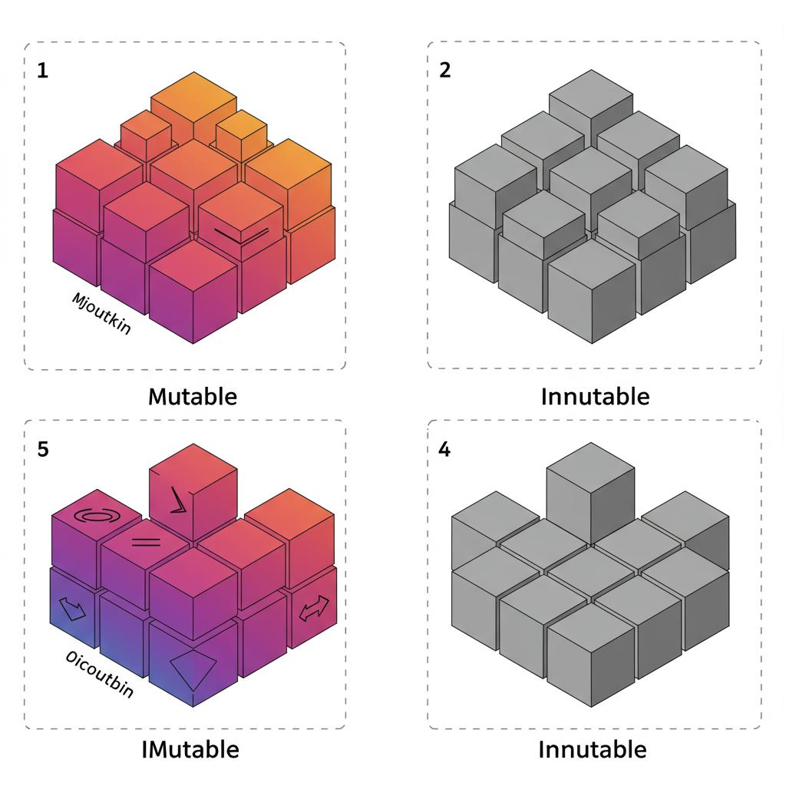

.. _module3-data-structures-lists-tuples:

======================================================
Module 3: Data Structures - Lists and Tuples
======================================================

Welcome to Module 3! So far, we've learned about individual pieces of data (like numbers and strings) and how to control the flow of our programs. But what if you need to work with a collection of items, like a list of student names, a series of temperature readings, or the coordinates of a point? That's where data structures come in. In this module, we'll focus on two fundamental sequence types in Python: **lists** and **tuples**.

Learning Objectives
-------------------

By the end of this module, you will be able to:

*   Understand what a data structure is and why it's useful.
*   Define, create, and initialize Python lists.
*   Access and modify list elements using indexing and slicing.
*   Use common list methods to manipulate lists (e.g., `append`, `insert`, `remove`, `pop`, `sort`, `reverse`).
*   Understand list mutability.
*   Define, create, and initialize Python tuples.
*   Access tuple elements using indexing and slicing.
*   Understand tuple immutability.
*   Perform tuple packing and unpacking.
*   Know when to use a list versus a tuple.
*   Iterate over lists and tuples using `for` loops.

----------------------------------------------------

What are Data Structures?
=========================

A **data structure** is a way of organizing and storing data in a computer so that it can be accessed and modified efficiently. Different data structures are suited for different kinds of applications, and some are highly specialized.

Python offers several built-in data structures, including:

*   **Lists:** Ordered, mutable (changeable) collections of items.
*   **Tuples:** Ordered, immutable (unchangeable) collections of items.
*   **Dictionaries:** Unordered collections of key-value pairs. (Covered in a later module)
*   **Sets:** Unordered collections of unique items. (Covered in a later module)

This module focuses on lists and tuples, which are both sequence types.

----------------------------------------------------

Lists
=====

A **list** is one of the most versatile and commonly used data structures in Python. It's an ordered collection of items, and these items can be of any data type (including other lists!). Lists are **mutable**, meaning you can change their content after they are created (add, remove, or modify elements).

Creating Lists
--------------
You create a list by placing items inside square brackets `[]`, separated by commas.

.. code-block:: python

    # An empty list
    empty_list = []
    print(empty_list)      # Output: []
    print(type(empty_list)) # Output: <class 'list'>

    # A list of integers
    numbers = [1, 2, 3, 4, 5]
    print(numbers)         # Output: [1, 2, 3, 4, 5]

    # A list of strings
    fruits = ["apple", "banana", "cherry"]
    print(fruits)          # Output: ['apple', 'banana', 'cherry']

    # A list with mixed data types
    mixed_list = [1, "hello", 3.14, True, [10, 20]]
    print(mixed_list)      # Output: [1, 'hello', 3.14, True, [10, 20]]

Accessing List Elements (Indexing)
----------------------------------
You can access individual items in a list using their **index**. Python uses zero-based indexing, meaning the first item is at index 0, the second at index 1, and so on.

.. code-block:: python

    fruits = ["apple", "banana", "cherry", "date"]
    # Index:    0        1         2        3

    print(fruits[0])  # Output: apple
    print(fruits[2])  # Output: cherry

    # Negative indexing: -1 refers to the last item, -2 to the second-to-last, etc.
    print(fruits[-1]) # Output: date
    print(fruits[-3]) # Output: banana

    # Accessing an element from a nested list
    data = [10, 20, ["a", "b"], 40]
    print(data[2])    # Output: ['a', 'b']
    print(data[2][1]) # Output: b

Slicing Lists
-------------
Slicing allows you to get a sub-list (a portion of the list). The syntax is `list[start:stop:step]`.

*   `start`: The index of the first item to include (default is 0).
*   `stop`: The index of the first item *not* to include (it goes up to, but doesn't include, this index).
*   `step`: The amount to increment by (default is 1).

.. code-block:: python

    numbers = [0, 1, 2, 3, 4, 5, 6, 7, 8, 9]
    # Index:   0  1  2  3  4  5  6  7  8  9

    print(numbers[2:5])   # Output: [2, 3, 4] (items from index 2 up to, but not including, index 5)
    print(numbers[:4])    # Output: [0, 1, 2, 3] (from the beginning up to index 4)
    print(numbers[6:])    # Output: [6, 7, 8, 9] (from index 6 to the end)
    print(numbers[-3:])   # Output: [7, 8, 9] (the last 3 items)
    print(numbers[::2])   # Output: [0, 2, 4, 6, 8] (every other item, step is 2)
    print(numbers[::-1])  # Output: [9, 8, 7, 6, 5, 4, 3, 2, 1, 0] (reverses the list)
    print(numbers[:])     # Output: [0, 1, 2, 3, 4, 5, 6, 7, 8, 9] (a shallow copy of the entire list)

Modifying Lists (Mutability)
----------------------------
Because lists are mutable, you can change their elements, add new ones, or remove existing ones.

.. code-block:: python

    colors = ["red", "green", "blue"]
    print(f"Original: {colors}")

    # Change an element
    colors[1] = "yellow"
    print(f"After change: {colors}") # Output: Original: ['red', 'green', 'blue']
                                     # Output: After change: ['red', 'yellow', 'blue']

    # Modify a slice
    numbers = [1, 2, 3, 4, 5]
    numbers[1:3] = [20, 30, 40] # Replace elements at index 1 and 2 with new elements
    print(numbers)              # Output: [1, 20, 30, 40, 4, 5]

Common List Methods
-------------------
Python lists come with many useful built-in methods:

*   `append(item)`: Adds `item` to the end of the list.
    .. code-block:: python
        my_list = [1, 2]
        my_list.append(3)
        print(my_list) # Output: [1, 2, 3]

*   `insert(index, item)`: Inserts `item` at the specified `index`.
    .. code-block:: python
        my_list = [1, 3]
        my_list.insert(1, 2) # Insert 2 at index 1
        print(my_list)     # Output: [1, 2, 3]

*   `remove(item)`: Removes the first occurrence of `item` from the list. Raises a `ValueError` if `item` is not found.
    .. code-block:: python
        my_list = ["a", "b", "c", "b"]
        my_list.remove("b")
        print(my_list) # Output: ['a', 'c', 'b']

*   `pop(index=-1)`: Removes and returns the item at `index`. If `index` is not specified, it removes and returns the last item.
    .. code-block:: python
        my_list = [10, 20, 30, 40]
        popped_item = my_list.pop()    # Removes and returns 40
        print(popped_item)           # Output: 40
        print(my_list)               # Output: [10, 20, 30]
        first_item = my_list.pop(0)  # Removes and returns 10
        print(first_item)            # Output: 10
        print(my_list)               # Output: [20, 30]

*   `index(item)`: Returns the index of the first occurrence of `item`. Raises a `ValueError` if `item` is not found.
    .. code-block:: python
        my_list = ["x", "y", "z"]
        print(my_list.index("y")) # Output: 1

*   `count(item)`: Returns the number of times `item` appears in the list.
    .. code-block:: python
        my_list = [1, 2, 2, 3, 2]
        print(my_list.count(2)) # Output: 3

*   `sort(key=None, reverse=False)`: Sorts the items of the list in place.
    .. code-block:: python
        numbers = [3, 1, 4, 1, 5, 9, 2]
        numbers.sort()
        print(numbers) # Output: [1, 1, 2, 3, 4, 5, 9]
        numbers.sort(reverse=True)
        print(numbers) # Output: [9, 5, 4, 3, 2, 1, 1]

*   `reverse()`: Reverses the elements of the list in place.
    .. code-block:: python
        my_list = [1, 2, 3]
        my_list.reverse()
        print(my_list) # Output: [3, 2, 1]

*   `clear()`: Removes all items from the list.
    .. code-block:: python
        my_list = [1, 2, 3]
        my_list.clear()
        print(my_list) # Output: []

*   `copy()`: Returns a shallow copy of the list.
    .. code-block:: python
        original = [1, 2, [3, 4]]
        copied_list = original.copy()
        copied_list[0] = 100
        copied_list[2][0] = 300 # Modifies nested list in both original and copy
        print(original)    # Output: [1, 2, [300, 4]]
        print(copied_list) # Output: [100, 2, [300, 4]]

The `len()` Function
--------------------
The built-in `len()` function (not a method) returns the number of items in a list.

.. code-block:: python
    my_list = ["a", "b", "c", "d"]
    print(len(my_list)) # Output: 4

Iterating Over Lists
--------------------
You can use a `for` loop to iterate over the items in a list.

.. code-block:: python
    fruits = ["apple", "banana", "cherry"]
    for fruit in fruits:
        print(fruit)
    # Output:
    # apple
    # banana
    # cherry

    # To get both index and item, use enumerate():
    for index, fruit in enumerate(fruits):
        print(f"Index {index}: {fruit}")
    # Output:
    # Index 0: apple
    # Index 1: banana
    # Index 2: cherry

----------------------------------------------------

Tuples
======

A **tuple** is similar to a list: it's an ordered collection of items. However, tuples are **immutable**, meaning once a tuple is created, you cannot change its contents (you can't add, remove, or modify elements).

Creating Tuples
---------------
You create a tuple by placing items inside parentheses `()`, separated by commas.

.. code-block:: python

    # An empty tuple
    empty_tuple = ()
    print(empty_tuple)      # Output: ()
    print(type(empty_tuple)) # Output: <class 'tuple'>

    # A tuple of integers
    numbers_tuple = (1, 2, 3, 4, 5)
    print(numbers_tuple)    # Output: (1, 2, 3, 4, 5)

    # A tuple with mixed data types
    mixed_tuple = (1, "hello", 3.14, True)
    print(mixed_tuple)      # Output: (1, 'hello', 3.14, True)

    # Parentheses are optional for tuple creation in many contexts (tuple packing)
    another_tuple = 10, 20, "world"
    print(another_tuple)    # Output: (10, 20, 'world')

    # Special case: Creating a tuple with a single item requires a trailing comma
    single_item_tuple = (99,) # The comma makes it a tuple
    not_a_tuple = (99)      # This is just the integer 99 in parentheses
    print(type(single_item_tuple)) # Output: <class 'tuple'>
    print(type(not_a_tuple))     # Output: <class 'int'>

Accessing Tuple Elements (Indexing and Slicing)
-----------------------------------------------
Accessing elements in a tuple works exactly like lists, using indexing and slicing.

.. code-block:: python

    my_tuple = ("a", "b", "c", "d", "e")
    print(my_tuple[0])    # Output: a
    print(my_tuple[-1])   # Output: e
    print(my_tuple[1:3])  # Output: ('b', 'c')

Immutability of Tuples
----------------------
This is the key difference from lists. You cannot change a tuple after its creation.

.. code-block:: python

    my_tuple = (10, 20, 30)
    # my_tuple[0] = 100  # This would raise a TypeError: 'tuple' object does not support item assignment
    # my_tuple.append(40) # This would raise an AttributeError: 'tuple' object has no attribute 'append'

    # However, if a tuple contains a mutable object (like a list), that object can be changed:
    mutable_inside_tuple = (1, 2, [3, 4])
    mutable_inside_tuple[2][0] = 300 # The list inside the tuple is changed
    print(mutable_inside_tuple)      # Output: (1, 2, [300, 4])
    # The tuple itself (its references to objects) remains unchanged.

Tuple Methods
-------------
Tuples have fewer methods than lists because they are immutable.

*   `count(item)`: Returns the number of times `item` appears in the tuple.
*   `index(item)`: Returns the index of the first occurrence of `item`.

.. code-block:: python

    my_tuple = (1, 2, 2, 3, 2, 4)
    print(my_tuple.count(2))  # Output: 3
    print(my_tuple.index(3))  # Output: 3

The `len()` function also works with tuples.

Tuple Packing and Unpacking
---------------------------
*   **Packing:** When you assign comma-separated values to a single variable, Python "packs" them into a tuple.
    .. code-block:: python
        point = 10, 20, 30 # Tuple packing
        print(point)       # Output: (10, 20, 30)

*   **Unpacking:** You can assign the items of a tuple (or list) to multiple variables.
    .. code-block:: python
        coordinates = (3, 7)
        x, y = coordinates # Tuple unpacking
        print(f"x: {x}, y: {y}") # Output: x: 3, y: 7

        # The number of variables must match the number of items in the tuple/list
        # a, b = (1, 2, 3) # ValueError: too many values to unpack

Why Use Tuples?
---------------
*   **Immutability:** Guarantees that the data won't be accidentally changed. Useful for representing fixed collections of items, like RGB color values `(255, 0, 0)`.
*   **Performance:** Tuples can be slightly faster than lists for iteration in some cases, though this difference is often negligible for small collections.
*   **Dictionary Keys:** Tuples can be used as keys in dictionaries (because they are immutable and hashable), while lists cannot. (More on this in the Dictionaries module).
*   **Readability:** Using a tuple can signal to someone reading your code that this collection of items is not meant to be changed.

----------------------------------------------------

Choosing Between Lists and Tuples
=================================

*   Use a **list** when:
    *   You need a collection of items that might change (add, remove, modify).
    *   The order of items matters.
    *   You need to sort or reverse the collection frequently.
*   Use a **tuple** when:
    *   You have a collection of items that should not change.
    *   You want to use the collection as a key in a dictionary.
    *   The order of items matters, but the collection is fixed.
    *   You want to ensure data integrity.

----------------------------------------------------

Mini-Project: Simple To-Do List Manager
=======================================

Let's use a list to create a basic command-line to-do list manager.

**Goal:**
1.  Allow the user to add tasks to a to-do list.
2.  Allow the user to view all tasks in the to-do list.
3.  Allow the user to mark a task as completed (remove it from the list).
4.  Allow the user to exit the program.

**Steps:**

1.  Initialize an empty list called `tasks`.
2.  Use a `while True` loop to create a menu-driven interface.
3.  Inside the loop, display options to the user: Add, View, Remove, Exit.
4.  Get the user's choice using `input()`.
5.  Use `if/elif/else` statements to handle the user's choice:
    *   **Add:** Prompt the user for the task description and `append()` it to the `tasks` list.
    *   **View:**
        *   If the list is empty, print "Your to-do list is empty."
        *   Otherwise, iterate through the `tasks` list using `enumerate()` to display each task with its number (e.g., "1. Buy groceries").
    *   **Remove:**
        *   First, display the tasks with numbers (like in View).
        *   If the list is empty, tell the user.
        *   Prompt the user for the number of the task to remove.
        *   Convert the input to an integer. Be sure to subtract 1 to get the correct index.
        *   Use `try-except` to handle potential `ValueError` (if input is not a number) or `IndexError` (if the number is out of range).
        *   If valid, use `pop()` to remove the task and print a confirmation.
    *   **Exit:** Print a goodbye message and `break` out of the loop.
    *   **Invalid Choice:** Print an error message.

**Example Interaction:**

.. code-block:: text

    To-Do List Manager
    --------------------
    1. Add Task
    2. View Tasks
    3. Remove Task
    4. Exit
    Enter your choice: 1
    Enter task description: Buy milk
    Task added!

    Enter your choice: 2
    Your To-Do List:
    1. Buy milk

    Enter your choice: 1
    Enter task description: Walk the dog
    Task added!

    Enter your choice: 2
    Your To-Do List:
    1. Buy milk
    2. Walk the dog

    Enter your choice: 3
    Your To-Do List:
    1. Buy milk
    2. Walk the dog
    Enter task number to remove: 1
    Task "Buy milk" removed.

    Enter your choice: 4
    Exiting To-Do List Manager. Goodbye!

.. admonition:: Solution (Try it yourself before looking!)
   :class: dropdown

   .. code-block:: python

       # todo_list_manager.py

       tasks = []

       def display_tasks():
           if not tasks:
               print("Your to-do list is empty.")
               return False # Indicate list is empty
           print("\nYour To-Do List:")
           for index, task in enumerate(tasks):
               print(f"{index + 1}. {task}")
           print("-" * 20)
           return True # Indicate list has tasks

       print("To-Do List Manager")
       print("--------------------")

       while True:
           print("\nMenu:")
           print("1. Add Task")
           print("2. View Tasks")
           print("3. Remove Task (Mark as Done)")
           print("4. Exit")

           choice = input("Enter your choice (1-4): ")

           if choice == '1':
               task_description = input("Enter task description: ")
               tasks.append(task_description)
               print(f"Task '{task_description}' added!")
           elif choice == '2':
               display_tasks()
           elif choice == '3':
               if display_tasks(): # Only proceed if there are tasks
                   try:
                       task_num_str = input("Enter task number to remove: ")
                       task_num = int(task_num_str)
                       if 1 <= task_num <= len(tasks):
                           removed_task = tasks.pop(task_num - 1) # Adjust for 0-based index
                           print(f"Task '{removed_task}' removed.")
                       else:
                           print("Invalid task number.")
                   except ValueError:
                       print("Invalid input. Please enter a number.")
                   except IndexError: # Should be caught by the if condition, but good practice
                       print("Invalid task number (out of range).")
           elif choice == '4':
               print("Exiting To-Do List Manager. Goodbye!")
               break
           else:
               print("Invalid choice. Please enter a number between 1 and 4.")

----------------------------------------------------

Module 3 Summary
================

Great job! You've now been introduced to two essential Python data structures:

*   **Lists** are ordered, **mutable** collections, perfect for when you need to store a sequence of items that might change. You learned how to create, index, slice, and use various methods like `append()`, `remove()`, and `sort()`.
*   **Tuples** are ordered, **immutable** collections, ideal for fixed sequences of data where integrity is important. You learned about their creation (especially the single-item tuple nuance), indexing, slicing, and why their immutability is useful.
*   You now understand the key differences between lists and tuples and have a better idea of when to use each.
*   Iterating over these sequences using `for` loops is a fundamental skill you've practiced.

These data structures are building blocks for more complex programs, allowing you to manage groups of related data efficiently.

In the next module, we'll explore more powerful data structures: **dictionaries and sets**, which offer different ways to organize and access data: :ref:`module4-data-structures-dictionaries-sets`!