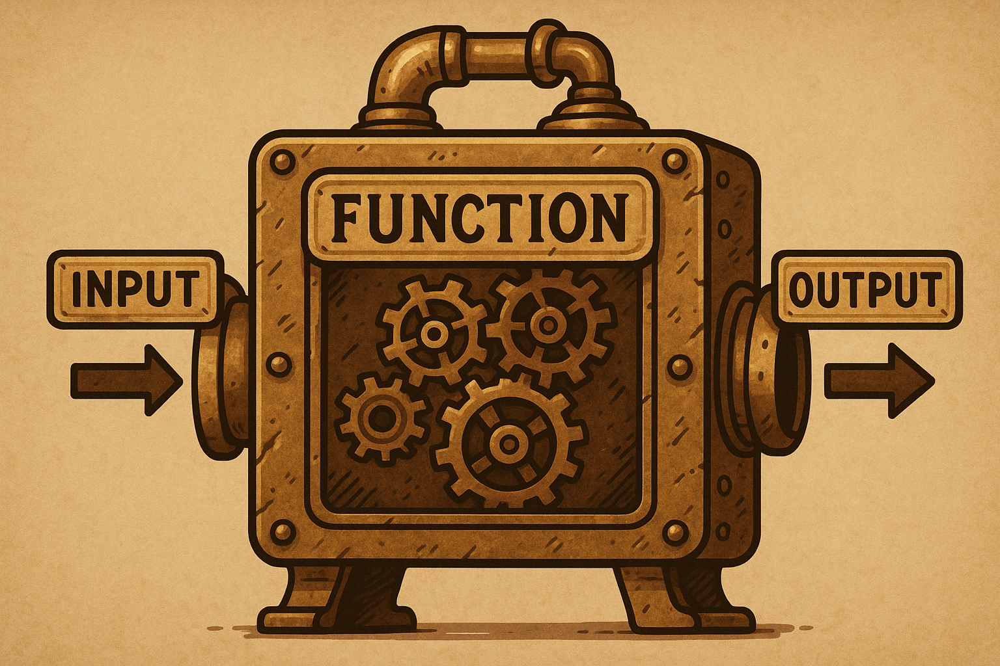

.. _module5-functions:

======================================================
Module 5: Functions - Writing Reusable Code
======================================================

Welcome to Module 5! As our programs grow larger and more complex, we need ways to organize our code, make it more readable, and avoid repetition. **Functions** are one of the most fundamental building blocks for achieving this. A function is a named block of reusable code that performs a specific task. By defining functions, you can break down your program into smaller, manageable pieces, making your code easier to understand, test, and maintain.




Learning Objectives
-------------------

By the end of this module, you will be able to:

*   Understand the purpose and benefits of using functions.
*   Define and call your own functions in Python using the `def` keyword.
*   Understand the difference between function parameters and arguments.
*   Use positional and keyword arguments when calling functions.
*   Set default values for function parameters.
*   Use the `return` statement to send data back from a function.
*   Understand variable scope (local vs. global variables).
*   Write docstrings to document your functions.
*   Understand the basics of lambda functions (anonymous functions).

----------------------------------------------------

What is a Function?
===================

A **function** is a block of organized, reusable code that is used to perform a single, related action. Functions provide better modularity for your application and a high degree of code reusing.

Think of built-in functions we've already used, like `print()`, `len()`, `input()`, `type()`, `int()`. These are pre-defined functions that perform specific tasks. Now, you'll learn to create your own!

Why Use Functions?
------------------
*   **Reusability:** Write the code once and use it multiple times in different parts of your program or even in other programs.
*   **Modularity:** Break down complex problems into smaller, simpler, and more manageable sub-problems. Each function can solve one part of the problem.
*   **Readability:** Well-named functions make your code easier to read and understand because the function name can describe its purpose.
*   **Maintainability:** If you need to change how a specific task is performed, you only need to modify the code within that function, rather than finding and changing it in multiple places.
*   **Abstraction:** Hide the complex implementation details of a task behind a simple function call. You only need to know what the function does, not necessarily *how* it does it.

----------------------------------------------------

Defining and Calling Functions
==============================

Defining a Function
-------------------
You define a function using the `def` keyword, followed by the function name, parentheses `()`, and a colon `:`. The code block within the function is indented.

.. code-block:: python

    def greet():  # Function definition
        """This function prints a simple greeting.""" # This is a docstring (optional but good practice)
        message = "Hello, Python learner!"
        print(message)

*   `def`: Keyword to start a function definition.
*   `greet`: The name of the function. Follow similar naming conventions as variables (lowercase with underscores, descriptive).
*   `()`: Parentheses. These can hold parameters (inputs to the function), which we'll cover shortly.
*   `:`: Colon to mark the end of the function header.
*   **Indented block:** The lines of code that make up the function's body.
*   **Docstring (Documentation String):** The string enclosed in triple quotes `"""..."""` right after the function header. It's used to document what the function does. It's optional but highly recommended.

Calling a Function
------------------
Once a function is defined, you can **call** it (or invoke it) by using its name followed by parentheses.

.. code-block:: python

    # Define the function (as above)
    def greet():
        """This function prints a simple greeting."""
        message = "Hello, Python learner!"
        print(message)

    # Call the function
    greet()  # Output: Hello, Python learner!
    greet()  # Call it again - Output: Hello, Python learner!

The code inside the `greet` function will execute each time `greet()` is called.

----------------------------------------------------

Function Parameters and Arguments
=================================

Often, you'll want your functions to operate on some input data. You can pass data to functions using **parameters** and **arguments**.

*   **Parameter:** A variable listed inside the parentheses in the function definition. It's a placeholder for the data that will be passed in.
*   **Argument:** The actual value that is sent to the function when it is called. This value is assigned to the corresponding parameter.

.. code-block:: python

    def greet_user(username):  # 'username' is a parameter
        """Greets a user by their name."""
        print(f"Hello, {username}! Welcome.")

    # Call the function with arguments
    greet_user("Alice")    # "Alice" is an argument. Output: Hello, Alice! Welcome.
    greet_user("Bob")      # "Bob" is an argument. Output: Hello, Bob! Welcome.

    my_name = "Charlie"
    greet_user(my_name)    # The value of 'my_name' ("Charlie") is the argument. Output: Hello, Charlie! Welcome.

Multiple Parameters
-------------------
A function can have multiple parameters, separated by commas.

.. code-block:: python

    def describe_pet(animal_type, pet_name):
        """Displays information about a pet."""
        print(f"I have a {animal_type}.")
        print(f"My {animal_type}'s name is {pet_name.title()}.")

    describe_pet("hamster", "harry")
    # Output:
    # I have a hamster.
    # My hamster's name is Harry.

    describe_pet("dog", "willie")
    # Output:
    # I have a dog.
    # My dog's name is Willie.

Types of Arguments
------------------

1.  **Positional Arguments:**
    When you call a function, Python matches arguments to parameters based on their order (position). The first argument goes to the first parameter, the second to the second, and so on.

    .. code-block:: python
        describe_pet("cat", "whiskers") # "cat" -> animal_type, "whiskers" -> pet_name

    The order matters. If you swap them:
    .. code-block:: python
        describe_pet("mittens", "dog") # "mittens" -> animal_type, "dog" -> pet_name
        # Output:
        # I have a mittens.
        # My mittens's name is Dog. (Probably not what you intended)

2.  **Keyword Arguments:**
    You can explicitly tell Python which parameter each argument should go to by using the parameter name followed by an equals sign and the value (`keyword=value`).
    The order of keyword arguments doesn't matter.

    .. code-block:: python
        describe_pet(animal_type="dog", pet_name="lucy")
        describe_pet(pet_name="goldie", animal_type="fish") # Order doesn't matter here

        # You can mix positional and keyword arguments, but positional arguments
        # must come before keyword arguments.
        describe_pet("bird", pet_name="polly") # Works
        # describe_pet(animal_type="snake", "kaa") # SyntaxError: positional argument follows keyword argument

Default Parameter Values
------------------------
You can provide a default value for a parameter in the function definition. If an argument for that parameter is not provided when the function is called, the default value is used.
Parameters with default values must come *after* parameters without default values in the function definition.

.. code-block:: python

    def describe_pet_v2(pet_name, animal_type="dog"): # animal_type has a default value
        """Displays information about a pet, with a default animal type."""
        print(f"I have a {animal_type}.")
        print(f"My {animal_type}'s name is {pet_name.title()}.")

    describe_pet_v2("buddy") # Uses default animal_type="dog"
    # Output:
    # I have a dog.
    # My dog's name is Buddy.

    describe_pet_v2("fluffy", "cat") # Overrides the default
    # Output:
    # I have a cat.
    # My cat's name is Fluffy.

    describe_pet_v2(pet_name="spike") # Using keyword argument for clarity
    # Output:
    # I have a dog.
    # My dog's name is Spike.

----------------------------------------------------

Return Values
=============

So far, our functions have printed output directly. But often, you want a function to perform a calculation or process data and then send a result *back* to the part of the code that called it. This is done using the `return` statement.

When a `return` statement is executed, the function immediately stops and sends the specified value back to the caller.

.. code-block:: python

    def add_numbers(x, y):
        """Adds two numbers and returns the sum."""
        total = x + y
        return total  # Sends the value of 'total' back

    sum_result = add_numbers(5, 3)
    print(f"The sum is: {sum_result}") # Output: The sum is: 8
    print(f"Another sum: {add_numbers(10, 20)}") # Output: Another sum: 30

    # The returned value can be used in expressions, assigned to variables, etc.
    if add_numbers(-2, 2) == 0:
        print("The sum is zero.") # Output: The sum is zero.

Returning Multiple Values
-------------------------
A function can return multiple values. Python does this by packing them into a tuple.

.. code-block:: python

    def get_name_and_age():
        """Returns a name and an age."""
        name = "Alice"
        age = 30
        return name, age # Returns a tuple: ("Alice", 30)

    returned_data = get_name_and_age()
    print(returned_data)        # Output: ('Alice', 30)
    print(returned_data[0])     # Output: Alice

    # You can also unpack the returned tuple directly
    user_name, user_age = get_name_and_age()
    print(f"Name: {user_name}, Age: {user_age}") # Output: Name: Alice, Age: 30

What if a function doesn't have a `return` statement?
------------------------------------------------------
If a function doesn't have a `return` statement, or has a `return` statement without a value (e.g., just `return`), it implicitly returns `None`.

.. code-block:: python

    def print_greeting(name):
        print(f"Hello, {name}")
        # No explicit return statement

    result = print_greeting("Eve") # Output: Hello, Eve
    print(result)                  # Output: None

----------------------------------------------------

Variable Scope
==============

**Scope** refers to the region of your code where a variable is accessible.

1.  **Local Variables:**
    Variables defined *inside* a function are local to that function. They can only be accessed from within that function. They are created when the function is called and destroyed when the function finishes.

    .. code-block:: python

        def my_function():
            local_var = "I am local"
            print(local_var)

        my_function() # Output: I am local
        # print(local_var) # This would cause a NameError because local_var is not defined in this scope

2.  **Global Variables:**
    Variables defined *outside* of any function are global. They can be accessed (read) from anywhere in your code, including inside functions.

    .. code-block:: python

        global_var = "I am global"

        def show_global():
            print(global_var) # Accessing global variable (read-only by default inside function)

        def try_to_modify_global_locally():
            # This creates a NEW local variable named global_var, shadowing the global one
            global_var = "I am trying to be local"
            print(f"Inside function: {global_var}")

        show_global()                   # Output: I am global
        try_to_modify_global_locally()  # Output: Inside function: I am trying to be local
        print(f"Outside function: {global_var}") # Output: Outside function: I am global (original global is unchanged)

Modifying Global Variables Inside a Function (`global` keyword)
---------------------------------------------------------------
If you need to *modify* a global variable from inside a function, you must explicitly tell Python using the `global` keyword. However, relying heavily on global variables is often discouraged as it can make code harder to understand and debug.

.. code-block:: python

    count = 0 # Global variable

    def increment_counter():
        global count # Declare that we want to use the global 'count'
        count += 1
        print(f"Counter inside function: {count}")

    increment_counter() # Output: Counter inside function: 1
    increment_counter() # Output: Counter inside function: 2
    print(f"Counter outside function: {count}") # Output: Counter outside function: 2

**LEGB Rule (Scope Resolution Order):**
When Python encounters a variable name, it searches for it in the following order:
1.  **L**ocal: The current function's scope.
2.  **E**nclosing function locals: Scopes of any enclosing functions (for nested functions).
3.  **G**lobal: The module's global scope.
4.  **B**uilt-in: Python's built-in names (like `print`, `len`).

----------------------------------------------------

Docstrings (Documentation Strings)
==================================

As mentioned earlier, a **docstring** is a string literal that occurs as the first statement in a module, function, class, or method definition. It's used to explain what the code does.

.. code-block:: python

    def calculate_area(length, width):
        """
        Calculate the area of a rectangle.

        Args:
            length (int or float): The length of the rectangle.
            width (int or float): The width of the rectangle.

        Returns:
            int or float: The calculated area of the rectangle.
                          Returns None if inputs are invalid (e.g., negative).
        """
        if length < 0 or width < 0:
            return None
        return length * width

Why are docstrings important?
*   **Documentation:** They provide a convenient way to document your code.
*   **Help Function:** The built-in `help()` function uses docstrings to provide information about objects.
    `help(calculate_area)` would display the docstring.
*   **Automated Tools:** Documentation generators (like Sphinx) can extract docstrings to create project documentation.

**Docstring Conventions:**
*   Enclose in triple quotes (`"""..."""`).
*   The first line should be a short, concise summary.
*   If more detail is needed, add a blank line after the summary, followed by more elaborate explanations.
*   Common sections include `Args:` (or `Parameters:`) and `Returns:`.

----------------------------------------------------

Lambda Functions (Anonymous Functions)
======================================

A **lambda function** is a small, anonymous (unnamed) function defined with the `lambda` keyword. They can take any number of arguments but can only have one expression. The expression is evaluated and returned.

Syntax: `lambda arguments: expression`

.. code-block:: python

    # A regular function to add two numbers
    def add(x, y):
        return x + y

    # Equivalent lambda function
    add_lambda = lambda x, y: x + y

    print(add(5, 3))          # Output: 8
    print(add_lambda(5, 3))   # Output: 8

    # Lambda function to square a number
    square = lambda num: num * num
    print(square(7))          # Output: 49

When are lambda functions useful?
*   **Short, simple operations:** When you need a small function for a short period and don't want to formally define it with `def`.
*   **As arguments to higher-order functions:** Functions that take other functions as arguments (e.g., `map()`, `filter()`, `sorted()`). This is a common use case.

.. code-block:: python

    numbers = [1, 2, 3, 4, 5]

    # Use lambda with map() to square each number
    # map(function, iterable)
    squared_numbers = list(map(lambda x: x * x, numbers))
    print(squared_numbers) # Output: [1, 4, 9, 16, 25]

    # Use lambda with filter() to get even numbers
    # filter(function, iterable) - function should return True/False
    even_numbers = list(filter(lambda x: x % 2 == 0, numbers))
    print(even_numbers)    # Output: [2, 4]

    # Use lambda with sorted() for custom sorting
    points = [(1, 2), (3, 1), (5, -4), (0, 0)]
    # Sort by the second element of each tuple
    sorted_points = sorted(points, key=lambda point: point[1])
    print(sorted_points)   # Output: [(5, -4), (0, 0), (3, 1), (1, 2)]

Lambda functions are limited in complexity. For more involved logic, a regular `def` function is more appropriate.

----------------------------------------------------

Mini-Project: Simple Calculator
===============================

Let's create a simple calculator that uses functions for different operations.

**Goal:**
1.  Create functions for addition, subtraction, multiplication, and division.
2.  The main part of the program should:
    *   Present a menu of operations to the user.
    *   Ask the user for two numbers.
    *   Call the appropriate function based on the user's choice.
    *   Display the result.
    *   Include error handling for division by zero and invalid input.
3.  Allow the user to perform multiple calculations or exit.

**Steps:**

1.  **Define Operation Functions:**
    *   `add(a, b)`: returns `a + b`
    *   `subtract(a, b)`: returns `a - b`
    *   `multiply(a, b)`: returns `a * b`
    *   `divide(a, b)`:
        *   Checks if `b` is zero. If so, prints an error message and returns `None` or a specific error string.
        *   Otherwise, returns `a / b`.
    *   Add docstrings to each function.
2.  **Main Program Loop:**
    *   Use a `while True` loop to keep the calculator running.
    *   Inside the loop, print a menu:
        ```
        Simple Calculator
        -----------------
        1. Add
        2. Subtract
        3. Multiply
        4. Divide
        5. Exit
        Enter your choice:
        ```
    *   Get the user's choice. If they choose to exit, `break` the loop.
3.  **Get User Input for Numbers:**
    *   If the choice is an operation (1-4), prompt the user to enter two numbers.
    *   Use a `try-except ValueError` block to handle cases where the user enters non-numeric input. If an error occurs, print a message and `continue` to the next iteration of the main loop.
4.  **Perform Calculation and Display Result:**
    *   Use `if/elif/else` to call the correct function based on the user's choice.
    *   Store the result.
    *   If the result is not `None` (especially for division), print it.
5.  **Handle Invalid Menu Choice.**

**Example Interaction:**

.. code-block:: text

    Simple Calculator
    -----------------
    1. Add
    2. Subtract
    3. Multiply
    4. Divide
    5. Exit
    Enter your choice: 1
    Enter first number: 10
    Enter second number: 5
    Result: 15.0

    Enter your choice: 4
    Enter first number: 10
    Enter second number: 0
    Error: Cannot divide by zero!

    Enter your choice: 5
    Exiting calculator. Goodbye!

.. admonition:: Solution (Try it yourself before looking!)
   :class: dropdown

   .. code-block:: python

       # simple_calculator.py

       def add(a, b):
           """Adds two numbers and returns the result."""
           return float(a + b)

       def subtract(a, b):
           """Subtracts the second number from the first and returns the result."""
           return float(a - b)

       def multiply(a, b):
           """Multiplies two numbers and returns the result."""
           return float(a * b)

       def divide(a, b):
           """Divides the first number by the second.
           Returns the result or an error message if division by zero."""
           if b == 0:
               return "Error: Cannot divide by zero!"
           return float(a / b)

       def main():
           """Main function to run the calculator."""
           while True:
               print("\nSimple Calculator")
               print("-----------------")
               print("1. Add")
               print("2. Subtract")
               print("3. Multiply")
               print("4. Divide")
               print("5. Exit")

               choice = input("Enter your choice (1-5): ")

               if choice == '5':
                   print("Exiting calculator. Goodbye!")
                   break

               if choice in ('1', '2', '3', '4'):
                   try:
                       num1_str = input("Enter first number: ")
                       num2_str = input("Enter second number: ")
                       num1 = float(num1_str)
                       num2 = float(num2_str)
                   except ValueError:
                       print("Invalid input. Please enter numeric values.")
                       continue # Go to the next iteration of the loop

                   result = None
                   if choice == '1':
                       result = add(num1, num2)
                   elif choice == '2':
                       result = subtract(num1, num2)
                   elif choice == '3':
                       result = multiply(num1, num2)
                   elif choice == '4':
                       result = divide(num1, num2)

                   print(f"Result: {result}")
               else:
                   print("Invalid choice. Please select a number between 1 and 5.")

       if __name__ == "__main__":
           # This ensures main() is called only when the script is executed directly,
           # not when imported as a module.
           main()

----------------------------------------------------

Module 5 Summary
================

Fantastic work on completing Module 5! Functions are a cornerstone of effective programming. You've learned:

*   How to **define and call functions** to create reusable blocks of code.
*   The use of **parameters and arguments** (positional, keyword) to pass data into functions.
*   How to set **default parameter values** for more flexible function calls.
*   The importance of the **`return` statement** for getting results back from functions.
*   The concept of **variable scope** (local vs. global) and how Python resolves variable names.
*   The value of **docstrings** for documenting your functions clearly.
*   The basics of **lambda functions** for creating small, anonymous functions, often used with higher-order functions.

By mastering functions, you can write code that is more organized, easier to read, simpler to debug, and much more efficient to develop and maintain.

In the upcoming modules, we'll build upon these concepts, exploring more advanced topics like object-oriented programming, file handling, and error management, where functions will continue to play a vital role.

Next, we'll delve into how to handle errors gracefully and manage exceptions in your programs: :ref:`module6-error-handling-exceptions`!