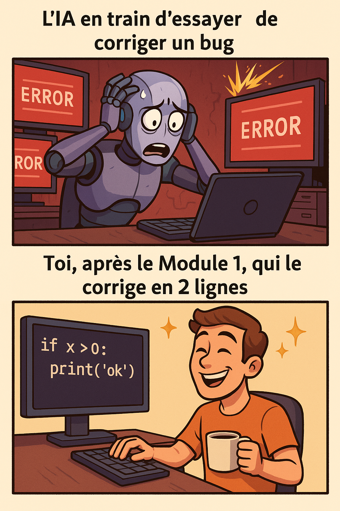

.. Documentation principale de "Python pour les Utilisateurs d'IA", créé par
   sphinx-quickstart le [Date].
   Vous pouvez adapter ce fichier complètement à votre guise, mais il doit au moins
   contenir la directive `toctree` racine.

=========================================================
Python pour les Utilisateurs d'IA : Codez Plus Malin, Pas Plus Dur
=========================================================

Bienvenue ! Arrêtez de vous battre avec le code généré par l'IA. Ce guide est conçu pour vous donner les compétences fondamentales en Python nécessaires pour prendre le contrôle, exploiter efficacement et collaborer avec l'IA dans vos projets de codage.

À une époque où l'IA augmente considérablement les flux de travail de développement, une solide compréhension des concepts de programmation de base reste inestimable. De nombreuses personnes se heurtent à des obstacles lorsqu'elles s'appuient uniquement sur du code généré par l'IA, luttant pour déboguer ou étendre des solutions au-delà des capacités immédiates de l'IA. Souvent, la « solution » est simple pour quelqu'un qui possède des notions de base en codage.

Ce cours comble cette lacune. Il est conçu pour :

*   **Les Collaborateurs d'IA en Devenir :** Ceux qui veulent utiliser plus efficacement les outils d'IA en comprenant le code qu'ils génèrent.
*   **Les Non-Programmeurs s'Aventurant dans le Développement Assisté par IA :** Ceux qui cherchent à construire des applications avec l'aide de l'IA mais qui ont besoin des connaissances fondamentales en Python pour guider, dépanner et personnaliser.
*   **Quiconque Cherche à Améliorer son « Codage à l'Instinct » avec de Vraies Compétences :** Si le potentiel de l'IA dans le codage vous passionne mais que vous voulez vous assurer de bâtir sur des fondations solides, ce cours est pour vous.

Notre objectif n'est pas seulement de vous enseigner la syntaxe Python, mais de vous doter des capacités de réflexion et de résolution de problèmes qui feront de vous un développeur plus compétent et indépendant, même en travaillant aux côtés de puissants outils d'IA.

--------------------
Navigation du Cours
--------------------

Ce cours vous guidera systématiquement à travers les bases de la programmation Python :

.. toctree::
   :maxdepth: 2
   :caption: Modules du Cours :

   module0_getting_started_fr
   module1_variables_and_data_types_fr
   module2_control_flow_fr
   module3_data_structures_lists_tuples_fr
   module4-data-structures-dictionaries-sets_fr
   module5_functions_fr

.. note::
   Au fur et à mesure de votre progression, vous trouverez des mini-projets dans chaque module conçus pour renforcer votre apprentissage et vous aider à appliquer ces concepts de manière pratique. Nous croyons à l'apprentissage par la pratique !

Nous sommes ravis de vous accompagner dans cette aventure d'apprentissage. Débloquons ensemble le plein potentiel de Python et de l'IA !