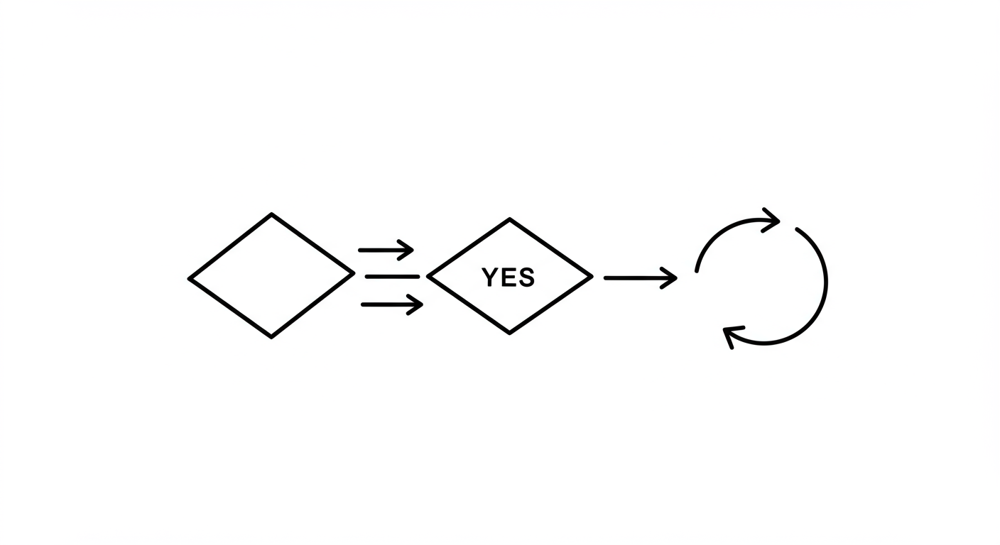

.. _module2-control-flow-fr:

====================================================================================
Module 2 : Flux de Contrôle - Prendre des Décisions et Répéter des Actions
====================================================================================

Bienvenue dans le Module 2 ! Dans le module précédent, nous avons appris à stocker et gérer des données en utilisant des variables et différents types de données. Maintenant, nous allons explorer comment contrôler le *flux* de nos programmes. Cela signifie prendre des décisions basées sur certaines conditions et répéter des tâches efficacement. Ce sont des concepts fondamentaux qui donnent à vos programmes intelligence et puissance.

Objectifs d'apprentissage
-------------------

À la fin de ce module, vous serez capable de :

*   Comprendre et utiliser les instructions conditionnelles (`if`, `elif`, `else`) pour prendre des décisions.
*   Utiliser les opérateurs de comparaison (`==`, `!=`, `>`, `<`, `>=`, `<=`) pour former des conditions.
*   Employer les opérateurs logiques (`and`, `or`, `not`) pour combiner plusieurs conditions.
*   Comprendre le concept de "vérité intrinsèque" (truthiness) en Python.
*   Implémenter des boucles `for` pour itérer sur des séquences (comme des chaînes de caractères ou des plages de nombres).
*   Utiliser la fonction `range()` pour générer des séquences pour les boucles.
*   Implémenter des boucles `while` pour répéter du code tant qu'une condition est vraie.
*   Contrôler l'exécution des boucles avec les instructions `break` et `continue`.
*   Écrire des programmes simples qui impliquent la prise de décision et la répétition.

----------------------------------------------------

Qu'est-ce que le Flux de Contrôle ?
=====================

Par défaut, les programmes Python exécutent les instructions les unes après les autres, de haut en bas. Le **flux de contrôle** (control flow) fait référence à l'ordre dans lequel ces instructions sont exécutées. Les instructions de flux de contrôle vous permettent de :

1.  **Prendre des Décisions :** Exécuter certains blocs de code uniquement si des conditions spécifiques sont remplies. (par ex., "Si l'utilisateur est un administrateur, afficher le panneau d'administration.")
2.  **Répéter des Actions :** Exécuter un bloc de code plusieurs fois. (par ex., "Pour chaque article d'une liste de courses, afficher son nom.")

----------------------------------------------------

Instructions Conditionnelles : `if`, `elif`, `else`
===========================================

Les instructions conditionnelles permettent à votre programme de choisir différents chemins en fonction de si une condition est `True` ou `False`.

L'instruction `if`
------------------
La forme la plus simple de prise de décision. Le bloc de code indenté sous l'instruction `if` ne s'exécute que si la `condition` est `True`.

.. code-block:: python

    age = 20
    if age >= 18:
        print("Vous êtes éligible pour voter.")
        print("Veuillez vous inscrire si ce n'est pas déjà fait.")

    print("Cette ligne s'exécute toujours, quelle que soit la condition.")

*   La `condition` (`age >= 18`) est suivie de deux-points (`:`).
*   Le code à exécuter si la condition est vraie est **indenté** (généralement 4 espaces). L'indentation est cruciale en Python ; elle définit les blocs de code.

L'instruction `else`
--------------------
Souvent, vous voulez faire une chose si une condition est vraie et autre chose si elle est fausse. L'instruction `else` gère cela.

.. code-block:: python

    temperature = 15
    if temperature > 25:
        print("C'est une journée chaude !")
    else:
        print("Ce n'est pas une journée chaude. Peut-être qu'il fait frais ou froid.")

    # Le code sous else s'exécute uniquement si la condition if (temperature > 25) est False.

L'instruction `elif` (Else If / Sinon Si)
-------------------------------
Lorsque vous avez plusieurs conditions à vérifier en séquence, vous pouvez utiliser `elif`. Python vérifie les conditions `elif` uniquement si les conditions `if` ou `elif` précédentes étaient `False`.

.. code-block:: python

    score = 85
    if score >= 90:
        note = "A"
    elif score >= 80: # Ceci est vérifié uniquement si score < 90
        note = "B"
    elif score >= 70:
        note = "C"
    elif score >= 60:
        note = "D"
    else:             # Ceci s'exécute si toutes les conditions précédentes sont False
        note = "F"

    print(f"Votre note est : {note}") # Sortie : Votre note est : B

Opérateurs de Comparaison
--------------------
Utilisés pour comparer des valeurs et former des conditions. Ils retournent un Booléen (`True` ou `False`).

*   `==` : Égal à
*   `!=` : Différent de
*   `>`  : Supérieur à
*   `<`  : Inférieur à
*   `>=` : Supérieur ou égal à
*   `<=` : Inférieur ou égal à

.. code-block:: python

    x = 10
    y = 5
    print(x == 10)    # True
    print(x != y)     # True
    print(x > y)      # True
    print(x < 5)      # False
    print(y >= 5)     # True

Opérateurs Logiques
-----------------
Utilisés pour combiner plusieurs expressions Booléennes :

*   `and`: Retourne `True` si **les deux** expressions sont vraies.
*   `or`:  Retourne `True` si **au moins une** expression est vraie.
*   `not`: Inverse la valeur Booléenne (`not True` est `False`, `not False` est `True`).

.. code-block:: python

    age = 22
    a_un_permis = True

    # Cette personne peut-elle louer une voiture ? (par ex., doit avoir 21 ans ou plus ET avoir un permis)
    if age >= 21 and a_un_permis:
        print("Éligible pour louer une voiture.")
    else:
        print("Non éligible pour louer une voiture.")

    est_le_weekend = False
    a_des_devoirs = True
    if est_le_weekend or not a_des_devoirs:
        print("C'est l'heure de se détendre !")
    else:
        print("Besoin de se concentrer ou de faire ses devoirs.")

Valeurs interprétées comme Vraies (Truthy) et Fausses (Falsy)
----------
En Python, de nombreuses valeurs ont une "vérité" ou "fausseté" intrinsèque lorsqu'elles sont utilisées dans un contexte Booléen (comme une condition `if`).

*   **Valeurs Falsy (interprétées comme Fausses) :**
    *   `False` (la valeur Booléenne)
    *   `None` (un objet spécial représentant l'absence de valeur)
    *   Zéro de tout type numérique (`0`, `0.0`)
    *   Séquences et collections vides : `""` (chaîne vide), `[]` (liste vide), `{}` (dictionnaire vide), `()` (tuple vide)
*   **Valeurs Truthy (interprétées comme Vraies) :** Pratiquement tout le reste est considéré comme `True`.

.. code-block:: python

    nom = ""
    if nom: # nom est une chaîne vide, ce qui est Falsy
        print(f"Bonjour, {nom}")
    else:
        print("Le nom est vide.") # Ceci sera affiché

    articles_dans_panier = 0
    if articles_dans_panier: # articles_dans_panier est 0, ce qui est Falsy
        print("Procéder au paiement.")
    else:
        print("Votre panier est vide.") # Ceci sera affiché

    ma_liste = [1, 2, 3]
    if ma_liste: # ma_liste n'est pas vide, donc elle est Truthy
        print("La liste contient des éléments.") # Ceci sera affiché

Instructions `if` Imbriquées
----------------------
Vous pouvez placer des instructions `if` à l'intérieur d'autres instructions `if`. Ceci est utile pour une prise de décision plus complexe.

.. code-block:: python

    est_connecte = True
    role_utilisateur = "admin"

    if est_connecte:
        print("Bienvenue !")
        if role_utilisateur == "admin":
            print("Accès au tableau de bord administrateur accordé.")
        elif role_utilisateur == "editor":
            print("Accès à l'édition de contenu accordé.")
        else:
            print("Accès utilisateur standard.")
    else:
        print("Veuillez vous connecter pour continuer.")

Soyez attentif à l'indentation avec les structures imbriquées.

----------------------------------------------------

Boucles : Répéter des Actions
========================

Les boucles sont utilisées pour exécuter un bloc de code de manière répétée. Python a deux principaux types de boucles : les boucles `for` et les boucles `while`.

La Boucle `for`
--------------
Une boucle `for` est utilisée pour itérer sur une **séquence** (comme une chaîne de caractères, une liste, un tuple) ou d'autres objets itérables.

**Itérer sur une chaîne de caractères :**

.. code-block:: python

    salutation = "Bonjour"
    for caractere_dans_salutation in salutation: # 'caractere_dans_salutation' est une variable que vous nommez
        print(caractere_dans_salutation)
    # Sortie :
    # B
    # o
    # n
    # j
    # o
    # u
    # r

**Utiliser `range()` :**
La fonction `range()` est souvent utilisée avec les boucles `for` pour exécuter un bloc de code un nombre spécifique de fois.

*   `range(stop)` : Génère des nombres de 0 jusqu'à (mais non inclus) `stop`.
    .. code-block:: python

        for i in range(5): # i sera 0, 1, 2, 3, 4
            print(f"Itération numéro : {i}")

*   `range(start, stop)` : Génère des nombres de `start` jusqu'à (mais non inclus) `stop`.
    .. code-block:: python

        for i in range(2, 6): # i sera 2, 3, 4, 5
            print(i)

*   `range(start, stop, step)` : Génère des nombres de `start` jusqu'à `stop`, en incrémentant de `step`.
    .. code-block:: python

        for i in range(0, 10, 2): # i sera 0, 2, 4, 6, 8
            print(i)

.. note::
    Nous en apprendrons plus sur les **listes** (un autre type de séquence courant) dans un module ultérieur. Les boucles `for` sont très puissantes pour travailler avec les listes :
    `ma_liste = [10, 20, 30]`
    `for element in ma_liste:`
    `    print(element)`

La Boucle `while`
----------------
Une boucle `while` répète un bloc de code tant qu'une `condition` donnée est `True`.

.. code-block:: python

    compteur = 0
    while compteur < 5:
        print(f"Le compteur est : {compteur}")
        compteur = compteur + 1 # Important : Mettez à jour la variable utilisée dans la condition !

    print("Boucle terminée.")
    # Sortie :
    # Le compteur est : 0
    # Le compteur est : 1
    # Le compteur est : 2
    # Le compteur est : 3
    # Le compteur est : 4
    # Boucle terminée.

**Boucles Infinies :**
Si la condition d'une boucle `while` ne devient jamais `False`, la boucle s'exécutera indéfiniment. C'est une **boucle infinie**. Vous voulez généralement les éviter. Si vous en créez une accidentellement, vous pouvez souvent l'arrêter en appuyant sur `Ctrl+C` dans le terminal.

.. code-block:: python
    :emphasize-lines: 3

    # DANGER : Exemple de Boucle Infinie (ne pas exécuter sauf si vous savez comment l'arrêter)
    # while True:
    #     print("Ceci s'affichera indéfiniment !")
    #     # Aucun moyen pour True de devenir False ici sans un 'break'

Instructions de Contrôle de Boucle
-----------------------

*   **`break`** : Quitte immédiatement la boucle actuelle (aussi bien `for` que `while`).
    .. code-block:: python

        for i in range(10):
            if i == 5:
                print("Trouvé 5, sortie de la boucle.")
                break # Quitte la boucle
            print(i)
        # Sortie : 0, 1, 2, 3, 4, Trouvé 5, sortie de la boucle.

*   **`continue`** : Saute le reste du code à l'intérieur de l'itération actuelle de la boucle et passe à l'itération suivante.
    .. code-block:: python

        for i in range(5):
            if i == 2:
                print("Saut de l'itération 2.")
                continue # Saute le reste de cette itération
            print(f"Traitement de l'itération {i}")
        # Sortie :
        # Traitement de l'itération 0
        # Traitement de l'itération 1
        # Saut de l'itération 2.
        # Traitement de l'itération 3
        # Traitement de l'itération 4

*   **Clause `else` dans les Boucles (Moins Courant) :**
    Les boucles `for` et `while` peuvent avoir une clause `else`. Le bloc `else` s'exécute si la boucle se termine normalement (c'est-à-dire qu'elle n'a pas été terminée par une instruction `break`).

    .. code-block:: python

        for i in range(3):
            print(f"Boucle : {i}")
        else:
            print("Boucle terminée sans 'break'.")
        # Sortie :
        # Boucle : 0
        # Boucle : 1
        # Boucle : 2
        # Boucle terminée sans 'break'.

        num = 7
        valeur_recherchee = 5
        while num > 0:
            if num == valeur_recherchee:
                print(f"Trouvé {valeur_recherchee} !")
                break
            num -= 1
        else: # S'exécute seulement si la condition de la boucle while devient fausse (num <= 0)
              # ET que 'break' n'a pas été rencontré
            print(f"{valeur_recherchee} non trouvé dans le compte à rebours.")

----------------------------------------------------

Mini-Projet : Jeu de Devine le Nombre
==================================

Combinons les boucles `if/elif/else` et `while` pour créer un simple jeu de devinette de nombre.

**Objectif :**
1.  L'ordinateur "pensera" à un nombre secret (par ex., entre 1 et 10).
2.  L'utilisateur essaiera de deviner le nombre.
3.  Le programme dira à l'utilisateur si sa supposition est trop haute, trop basse ou correcte.
4.  Le jeu continue jusqu'à ce que l'utilisateur devine correctement.
5.  (Optionnel) Compter le nombre de tentatives.

**Étapes :**

1.  **Choisissez un nombre secret.** Pour l'instant, vous pouvez le coder en dur (l'assigner directement à une variable). Plus tard, nous pourrons apprendre à le rendre aléatoire.
    `secret_number = 7` (nombre_secret)
2.  Utilisez une boucle `while True` pour maintenir le jeu jusqu'à ce que l'utilisateur devine correctement. À l'intérieur de la boucle, vous utiliserez `break` pour sortir lorsqu'il gagne.
3.  À l'intérieur de la boucle :
    *   Demandez à l'utilisateur sa supposition en utilisant `input()`.
    *   Convertissez l'entrée en entier en utilisant `int()`. N'oubliez pas de gérer une `ValueError` potentielle si l'utilisateur tape une entrée non numérique (vous pouvez le faire avec un bloc `try-except`, ou pour simplifier à ce stade précoce, supposez une entrée valide).
    *   Utilisez `if/elif/else` pour comparer la supposition avec `secret_number`.
    *   Affichez "Trop haut !", "Trop bas !", ou "Correct !"
    *   Si c'est correct, affichez un message de félicitations et sortez de la boucle avec `break`.
4.  (Optionnel) Initialisez une variable `guesses_count` (nombre_tentatives) à 0 avant la boucle. Incrémentez-la à l'intérieur de la boucle pour chaque supposition. Affichez-la lorsque l'utilisateur gagne.

**Exemple d'Interaction :**

.. code-block:: text

    Devinez le nombre (entre 1 et 10) : 5
    Trop bas !
    Devinez le nombre (entre 1 et 10) : 8
    Trop haut !
    Devinez le nombre (entre 1 et 10) : 7
    Correct ! Vous l'avez deviné en 3 essais.

.. admonition:: Solution (Essayez par vous-même avant de regarder !)
   :class: dropdown

   .. code-block:: python

       # jeu_devine_nombre.py

       secret_number = 7
       guesses_count = 0
       max_guesses = 5 # Optionnel : limiter les tentatives

       print("Bienvenue au Jeu de Devine le Nombre !")
       print(f"Je pense à un nombre entre 1 et 10. Vous avez {max_guesses} essais.")

       while guesses_count < max_guesses:
           try:
               guess_str = input(f"Tentative #{guesses_count + 1}: ")
               guess = int(guess_str)
           except ValueError:
               print("Entrée invalide. Veuillez entrer un nombre.")
               continue # Passer à la prochaine itération

           guesses_count += 1 # Incrémenter le compteur de tentatives

           if guess < secret_number:
               print("Trop bas !")
           elif guess > secret_number:
               print("Trop haut !")
           else:
               print(f"Correct ! Vous avez deviné le nombre {secret_number} en {guesses_count} essais.")
               break # Sortir de la boucle car la supposition est correcte
       else:
           # Cette clause else de la boucle while s'exécute si la boucle s'est terminée
           # parce que guesses_count a atteint max_guesses (et non à cause d'un 'break')
           if guess != secret_number: # Vérifier s'ils ne l'ont pas deviné au dernier essai
                print(f"Désolé, vous n'avez plus d'essais. Le nombre était {secret_number}.")

----------------------------------------------------

Résumé du Module 2
================

Excellent ! Vous avez maintenant appris comment rendre vos programmes Python beaucoup plus dynamiques :

*   Les **instructions conditionnelles (`if`, `elif`, `else`)** permettent à votre code de prendre des décisions et d'exécuter différents chemins en fonction des conditions.
*   Les **opérateurs de comparaison (`==`, `!=`, etc.) et logiques (`and`, `or`, `not`)** sont essentiels pour construire ces conditions.
*   Les **boucles `for`** sont idéales pour itérer sur des séquences ou exécuter du code un nombre fixe de fois (en utilisant `range()`).
*   Les **boucles `while`** répètent du code tant qu'une condition reste vraie, parfaites pour les situations où vous ne connaissez pas le nombre exact d'itérations à l'avance.
*   **`break` et `continue`** vous donnent un contrôle plus fin sur l'exécution des boucles.

Avec le flux de contrôle, vos programmes peuvent commencer à présenter un comportement plus complexe et intelligent. Ce sont des outils fondamentaux que vous utiliserez dans presque tous les programmes Python que vous écrirez.

Dans le prochain module, nous commencerons à organiser nos données plus efficacement en apprenant les **structures de données comme les listes et les tuples** : :ref:`module3-data-structures-lists-tuples-fr` !