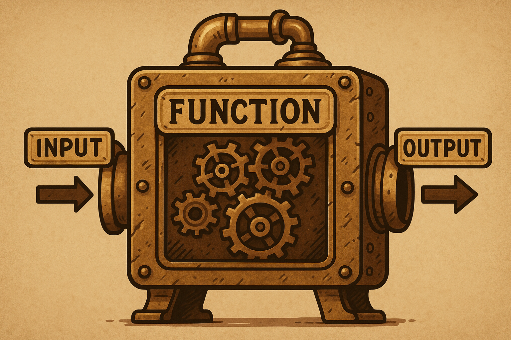

.. _module5-functions-fr:

=============================================================
Module 5 : Fonctions - Écrire du Code Réutilisable
=============================================================

Bienvenue dans le Module 5 ! À mesure que nos programmes deviennent plus volumineux et complexes, nous avons besoin de moyens pour organiser notre code, le rendre plus lisible et éviter la répétition. Les **fonctions** sont l'un des blocs de construction les plus fondamentaux pour y parvenir. Une fonction est un bloc de code nommé et réutilisable qui effectue une tâche spécifique. En définissant des fonctions, vous pouvez décomposer votre programme en morceaux plus petits et gérables, ce qui rend votre code plus facile à comprendre, à tester et à maintenir.




Objectifs d'apprentissage
-------------------

À la fin de ce module, vous serez capable de :

*   Comprendre le but et les avantages de l'utilisation des fonctions.
*   Définir et appeler vos propres fonctions en Python en utilisant le mot-clé `def`.
*   Comprendre la différence entre les paramètres de fonction et les arguments.
*   Utiliser les arguments positionnels et nommés (par mot-clé) lors de l'appel de fonctions.
*   Définir des valeurs par défaut pour les paramètres de fonction.
*   Utiliser l'instruction `return` pour renvoyer des données depuis une fonction.
*   Comprendre la portée des variables (variables locales vs globales).
*   Écrire des docstrings pour documenter vos fonctions.
*   Comprendre les bases des fonctions lambda (fonctions anonymes).

----------------------------------------------------

Qu'est-ce qu'une Fonction ?
===================

Une **fonction** est un bloc de code organisé et réutilisable utilisé pour effectuer une action unique et connexe. Les fonctions offrent une meilleure modularité à votre application et un haut degré de réutilisation du code.

Pensez aux fonctions intégrées que nous avons déjà utilisées, comme `print()`, `len()`, `input()`, `type()`, `int()`. Ce sont des fonctions prédéfinies qui effectuent des tâches spécifiques. Maintenant, vous allez apprendre à créer les vôtres !

Pourquoi Utiliser des Fonctions ?
------------------
*   **Réutilisabilité :** Écrivez le code une fois et utilisez-le plusieurs fois dans différentes parties de votre programme ou même dans d'autres programmes.
*   **Modularité :** Décomposez les problèmes complexes en sous-problèmes plus petits, plus simples et plus gérables. Chaque fonction peut résoudre une partie du problème.
*   **Lisibilité :** Des fonctions bien nommées rendent votre code plus facile à lire et à comprendre car le nom de la fonction peut décrire son objectif.
*   **Maintenabilité :** Si vous devez modifier la manière dont une tâche spécifique est effectuée, vous n'avez qu'à modifier le code à l'intérieur de cette fonction, plutôt que de le rechercher et de le modifier à plusieurs endroits.
*   **Abstraction :** Cachez les détails d'implémentation complexes d'une tâche derrière un simple appel de fonction. Vous n'avez besoin de savoir que ce que fait la fonction, pas nécessairement *comment* elle le fait.

----------------------------------------------------

Définition et Appel de Fonctions
==============================

Définition d'une Fonction
-------------------
Vous définissez une fonction en utilisant le mot-clé `def`, suivi du nom de la fonction, de parenthèses `()` et de deux-points `:`. Le bloc de code à l'intérieur de la fonction est indenté.

.. code-block:: python

    def saluer():  # Définition de la fonction
        """Cette fonction affiche une simple salutation.""" # Ceci est un docstring (optionnel mais bonne pratique)
        message = "Bonjour, apprenant Python !"
        print(message)

*   `def`: Mot-clé pour commencer la définition d'une fonction.
*   `saluer`: Le nom de la fonction. Suivez des conventions de nommage similaires à celles des variables (minuscules avec des tirets bas, descriptif).
*   `()`: Parenthèses. Elles peuvent contenir des paramètres (entrées de la fonction), que nous aborderons sous peu.
*   `:`: Deux-points pour marquer la fin de l'en-tête de la fonction.
*   **Bloc indenté :** Les lignes de code qui constituent le corps de la fonction.
*   **Docstring (Chaîne de documentation) :** La chaîne de caractères encadrée par des triples guillemets `"""..."""` juste après l'en-tête de la fonction. Elle est utilisée pour documenter ce que fait la fonction. C'est optionnel mais fortement recommandé.

Appel d'une Fonction
------------------
Une fois qu'une fonction est définie, vous pouvez l'**appeler** (ou l'invoquer) en utilisant son nom suivi de parenthèses.

.. code-block:: python

    # Définir la fonction (comme ci-dessus)
    def saluer():
        """Cette fonction affiche une simple salutation."""
        message = "Bonjour, apprenant Python !"
        print(message)

    # Appeler la fonction
    saluer()  # Sortie : Bonjour, apprenant Python !
    saluer()  # L'appeler à nouveau - Sortie : Bonjour, apprenant Python !

Le code à l'intérieur de la fonction `saluer` s'exécutera à chaque fois que `saluer()` est appelée.

----------------------------------------------------

Paramètres et Arguments de Fonction
=================================

Souvent, vous voudrez que vos fonctions opèrent sur des données d'entrée. Vous pouvez passer des données aux fonctions en utilisant des **paramètres** et des **arguments**.

*   **Paramètre :** Une variable listée à l'intérieur des parenthèses dans la définition de la fonction. C'est un espace réservé pour les données qui seront passées.
*   **Argument :** La valeur réelle qui est envoyée à la fonction lorsqu'elle est appelée. Cette valeur est affectée au paramètre correspondant.

.. code-block:: python

    def saluer_utilisateur(nom_utilisateur):  # 'nom_utilisateur' est un paramètre
        """Salue un utilisateur par son nom."""
        print(f"Bonjour, {nom_utilisateur} ! Bienvenue.")

    # Appeler la fonction avec des arguments
    saluer_utilisateur("Alice")    # "Alice" est un argument. Sortie : Bonjour, Alice ! Bienvenue.
    saluer_utilisateur("Bob")      # "Bob" est un argument. Sortie : Bonjour, Bob ! Bienvenue.

    mon_nom = "Charlie"
    saluer_utilisateur(mon_nom)    # La valeur de 'mon_nom' ("Charlie") est l'argument. Sortie : Bonjour, Charlie ! Bienvenue.

Paramètres Multiples
-------------------
Une fonction peut avoir plusieurs paramètres, séparés par des virgules.

.. code-block:: python

    def decrire_animal(type_animal, nom_animal):
        """Affiche des informations sur un animal de compagnie."""
        print(f"J'ai un(e) {type_animal}.")
        print(f"Mon/Ma {type_animal} s'appelle {nom_animal.title()}.")

    decrire_animal("hamster", "harry")
    # Sortie :
    # J'ai un(e) hamster.
    # Mon/Ma hamster s'appelle Harry.

    decrire_animal("chien", "willie")
    # Sortie :
    # J'ai un(e) chien.
    # Mon/Ma chien s'appelle Willie.

Types d'Arguments
------------------

1.  **Arguments Positionnels :**
    Lorsque vous appelez une fonction, Python fait correspondre les arguments aux paramètres en fonction de leur ordre (position). Le premier argument va au premier paramètre, le deuxième au deuxième, et ainsi de suite.

    .. code-block:: python
        decrire_animal("chat", "moustache") # "chat" -> type_animal, "moustache" -> nom_animal

    L'ordre est important. Si vous les inversez :
    .. code-block:: python
        decrire_animal("mitaine", "chien") # "mitaine" -> type_animal, "chien" -> nom_animal
        # Sortie :
        # J'ai un(e) mitaine.
        # Mon/Ma mitaine s'appelle Chien. (Probablement pas ce que vous vouliez)

2.  **Arguments Nommés (par Mot-Clé) :**
    Vous pouvez explicitement indiquer à Python à quel paramètre chaque argument doit aller en utilisant le nom du paramètre suivi d'un signe égal et de la valeur (`mot_cle=valeur`).
    L'ordre des arguments nommés n'a pas d'importance.

    .. code-block:: python
        decrire_animal(type_animal="chien", nom_animal="lucy")
        decrire_animal(nom_animal="goldie", type_animal="poisson") # L'ordre n'a pas d'importance ici

        # Vous pouvez mélanger les arguments positionnels et nommés, mais les arguments positionnels
        # doivent précéder les arguments nommés.
        decrire_animal("oiseau", nom_animal="polly") # Fonctionne
        # decrire_animal(type_animal="serpent", "kaa") # SyntaxError: positional argument follows keyword argument

Valeurs par Défaut des Paramètres
------------------------
Vous pouvez fournir une valeur par défaut pour un paramètre dans la définition de la fonction. Si un argument pour ce paramètre n'est pas fourni lors de l'appel de la fonction, la valeur par défaut est utilisée.
Les paramètres avec des valeurs par défaut doivent venir *après* les paramètres sans valeurs par défaut dans la définition de la fonction.

.. code-block:: python

    def decrire_animal_v2(nom_animal, type_animal="chien"): # type_animal a une valeur par défaut
        """Affiche des informations sur un animal, avec un type d'animal par défaut."""
        print(f"J'ai un(e) {type_animal}.")
        print(f"Mon/Ma {type_animal} s'appelle {nom_animal.title()}.")

    decrire_animal_v2("buddy") # Utilise type_animal="chien" par défaut
    # Sortie :
    # J'ai un(e) chien.
    # Mon/Ma chien s'appelle Buddy.

    decrire_animal_v2("fluffy", "chat") # Remplace la valeur par défaut
    # Sortie :
    # J'ai un(e) chat.
    # Mon/Ma chat s'appelle Fluffy.

    decrire_animal_v2(nom_animal="spike") # Utilisation d'un argument nommé pour plus de clarté
    # Sortie :
    # J'ai un(e) chien.
    # Mon/Ma chien s'appelle Spike.

----------------------------------------------------

Valeurs de Retour
=============

Jusqu'à présent, nos fonctions ont affiché des sorties directement. Mais souvent, vous voulez qu'une fonction effectue un calcul ou traite des données, puis renvoie un résultat à la partie du code qui l'a appelée. Cela se fait en utilisant l'instruction `return`.

Lorsqu'une instruction `return` est exécutée, la fonction s'arrête immédiatement et renvoie la valeur spécifiée à l'appelant.

.. code-block:: python

    def additionner_nombres(x, y):
        """Additionne deux nombres et retourne la somme."""
        total = x + y
        return total  # Renvoie la valeur de 'total'

    resultat_somme = additionner_nombres(5, 3)
    print(f"La somme est : {resultat_somme}") # Sortie : La somme est : 8
    print(f"Autre somme : {additionner_nombres(10, 20)}") # Sortie : Autre somme : 30

    # La valeur retournée peut être utilisée dans des expressions, affectée à des variables, etc.
    if additionner_nombres(-2, 2) == 0:
        print("La somme est zéro.") # Sortie : La somme est zéro.

Retour de Valeurs Multiples
-------------------------
Une fonction peut retourner plusieurs valeurs. Python le fait en les empaquetant dans un tuple.

.. code-block:: python

    def obtenir_nom_et_age():
        """Retourne un nom et un âge."""
        nom = "Alice"
        age = 30
        return nom, age # Retourne un tuple : ("Alice", 30)

    donnees_retournees = obtenir_nom_et_age()
    print(donnees_retournees)        # Sortie : ('Alice', 30)
    print(donnees_retournees[0])     # Sortie : Alice

    # Vous pouvez également dépaqueter le tuple retourné directement
    nom_utilisateur, age_utilisateur = obtenir_nom_et_age()
    print(f"Nom : {nom_utilisateur}, Âge : {age_utilisateur}") # Sortie : Nom : Alice, Âge : 30

Que se passe-t-il si une fonction n'a pas d'instruction `return` ?
------------------------------------------------------
Si une fonction n'a pas d'instruction `return`, ou a une instruction `return` sans valeur (par ex., juste `return`), elle retourne implicitement `None`.

.. code-block:: python

    def afficher_salutation(nom):
        print(f"Bonjour, {nom}")
        # Pas d'instruction return explicite

    resultat = afficher_salutation("Eve") # Sortie : Bonjour, Eve
    print(resultat)                  # Sortie : None

----------------------------------------------------

Portée des Variables (Scope)
==============

La **portée (scope)** fait référence à la région de votre code où une variable est accessible.

1.  **Variables Locales :**
    Les variables définies *à l'intérieur* d'une fonction sont locales à cette fonction. Elles ne peuvent être accédées que depuis l'intérieur de cette fonction. Elles sont créées lorsque la fonction est appelée et détruites lorsque la fonction se termine.

    .. code-block:: python

        def ma_fonction():
            var_locale = "Je suis locale"
            print(var_locale)

        ma_fonction() # Sortie : Je suis locale
        # print(var_locale) # Ceci causerait une NameError car var_locale n'est pas définie dans cette portée

2.  **Variables Globales :**
    Les variables définies *en dehors* de toute fonction sont globales. Elles peuvent être accédées (lues) depuis n'importe où dans votre code, y compris à l'intérieur des fonctions.

    .. code-block:: python

        var_globale = "Je suis globale"

        def montrer_globale():
            print(var_globale) # Accès à la variable globale (lecture seule par défaut dans la fonction)

        def essayer_de_modifier_globale_localement():
            # Ceci crée une NOUVELLE variable locale nommée var_globale, masquant la globale
            var_globale = "J'essaie d'être locale"
            print(f"Dans la fonction : {var_globale}")

        montrer_globale()                   # Sortie : Je suis globale
        essayer_de_modifier_globale_localement()  # Sortie : Dans la fonction : J'essaie d'être locale
        print(f"Hors de la fonction : {var_globale}") # Sortie : Hors de la fonction : Je suis globale (la globale originale est inchangée)

Modification des Variables Globales à l'Intérieur d'une Fonction (mot-clé `global`)
---------------------------------------------------------------
Si vous avez besoin de *modifier* une variable globale depuis l'intérieur d'une fonction, vous devez explicitement le dire à Python en utilisant le mot-clé `global`. Cependant, s'appuyer fortement sur les variables globales est souvent déconseillé car cela peut rendre le code plus difficile à comprendre et à déboguer.

.. code-block:: python

    compteur = 0 # Variable globale

    def incrementer_compteur():
        global compteur # Déclare que nous voulons utiliser le 'compteur' global
        compteur += 1
        print(f"Compteur dans la fonction : {compteur}")

    incrementer_compteur() # Sortie : Compteur dans la fonction : 1
    incrementer_compteur() # Sortie : Compteur dans la fonction : 2
    print(f"Compteur hors de la fonction : {compteur}") # Sortie : Compteur hors de la fonction : 2

**Règle LEGB (Ordre de Résolution des Portées) :**
Lorsque Python rencontre un nom de variable, il le recherche dans l'ordre suivant :
1.  **L**ocal : La portée de la fonction actuelle.
2.  **E**nclosing function locals (Variables locales des fonctions englobantes) : Portées de toutes les fonctions englobantes (pour les fonctions imbriquées).
3.  **G**lobal : La portée globale du module.
4.  **B**uilt-in (Noms intégrés) : Les noms intégrés de Python (comme `print`, `len`).

----------------------------------------------------

Docstrings (Chaînes de Documentation)
==================================

Comme mentionné précédemment, un **docstring** est une chaîne de caractères littérale qui apparaît comme la première instruction dans la définition d'un module, d'une fonction, d'une classe ou d'une méthode. Elle est utilisée pour expliquer ce que fait le code.

.. code-block:: python

    def calculer_aire(longueur, largeur):
        """
        Calcule l'aire d'un rectangle.

        Args:
            longueur (int or float): La longueur du rectangle.
            largeur (int or float): La largeur du rectangle.

        Returns:
            int or float: L'aire calculée du rectangle.
                          Retourne None si les entrées sont invalides (par ex., négatives).
        """
        if longueur < 0 or largeur < 0:
            return None
        return longueur * largeur

Pourquoi les docstrings sont-elles importantes ?
*   **Documentation :** Elles fournissent un moyen pratique de documenter votre code.
*   **Fonction Help :** La fonction intégrée `help()` utilise les docstrings pour fournir des informations sur les objets.
    `help(calculer_aire)` afficherait le docstring.
*   **Outils Automatisés :** Les générateurs de documentation (comme Sphinx) peuvent extraire les docstrings pour créer la documentation du projet.

**Conventions des Docstrings :**
*   Encadrez par des triples guillemets (`"""..."""`).
*   La première ligne doit être un résumé court et concis.
*   Si plus de détails sont nécessaires, ajoutez une ligne vide après le résumé, suivie d'explications plus élaborées.
*   Les sections courantes incluent `Args:` (ou `Parameters:`) et `Returns:`.

----------------------------------------------------

Fonctions Lambda (Fonctions Anonymes)
======================================

Une **fonction lambda** est une petite fonction anonyme (sans nom) définie avec le mot-clé `lambda`. Elles peuvent prendre n'importe quel nombre d'arguments mais ne peuvent avoir qu'une seule expression. L'expression est évaluée et retournée.

Syntaxe : `lambda arguments: expression`

.. code-block:: python

    # Une fonction régulière pour additionner deux nombres
    def addition(x, y):
        return x + y

    # Fonction lambda équivalente
    addition_lambda = lambda x, y: x + y

    print(addition(5, 3))          # Sortie : 8
    print(addition_lambda(5, 3))   # Sortie : 8

    # Fonction lambda pour mettre un nombre au carré
    carre = lambda num: num * num
    print(carre(7))          # Sortie : 49

Quand les fonctions lambda sont-elles utiles ?
*   **Opérations courtes et simples :** Lorsque vous avez besoin d'une petite fonction pour une courte période et que vous ne voulez pas la définir formellement avec `def`.
*   **Comme arguments de fonctions d'ordre supérieur :** Fonctions qui prennent d'autres fonctions comme arguments (par ex., `map()`, `filter()`, `sorted()`). C'est un cas d'utilisation courant.

.. code-block:: python

    nombres = [1, 2, 3, 4, 5]

    # Utiliser lambda avec map() pour mettre chaque nombre au carré
    # map(fonction, iterable)
    nombres_au_carre = list(map(lambda x: x * x, nombres))
    print(nombres_au_carre) # Sortie : [1, 4, 9, 16, 25]

    # Utiliser lambda avec filter() pour obtenir les nombres pairs
    # filter(fonction, iterable) - la fonction doit retourner True/False
    nombres_pairs = list(filter(lambda x: x % 2 == 0, nombres))
    print(nombres_pairs)    # Sortie : [2, 4]

    # Utiliser lambda avec sorted() pour un tri personnalisé
    points = [(1, 2), (3, 1), (5, -4), (0, 0)]
    # Trier par le deuxième élément de chaque tuple
    points_tries = sorted(points, key=lambda point: point[1])
    print(points_tries)   # Sortie : [(5, -4), (0, 0), (3, 1), (1, 2)]

Les fonctions lambda sont limitées en complexité. Pour une logique plus impliquée, une fonction `def` régulière est plus appropriée.

----------------------------------------------------

Mini-Projet : Calculatrice Simple
===============================

Créons une calculatrice simple qui utilise des fonctions pour différentes opérations.

**Objectif :**
1.  Créer des fonctions pour l'addition, la soustraction, la multiplication et la division.
2.  La partie principale du programme doit :
    *   Présenter un menu d'opérations à l'utilisateur.
    *   Demander à l'utilisateur deux nombres.
    *   Appeler la fonction appropriée en fonction du choix de l'utilisateur.
    *   Afficher le résultat.
    *   Inclure la gestion des erreurs pour la division par zéro et les entrées invalides.
3.  Permettre à l'utilisateur d'effectuer plusieurs calculs ou de quitter.

**Étapes :**

1.  **Définir les Fonctions d'Opération :**
    *   `additionner(a, b)`: retourne `a + b`
    *   `soustraire(a, b)`: retourne `a - b`
    *   `multiplier(a, b)`: retourne `a * b`
    *   `diviser(a, b)`:
        *   Vérifie si `b` est zéro. Si oui, affiche un message d'erreur et retourne `None` ou une chaîne d'erreur spécifique.
        *   Sinon, retourne `a / b`.
    *   Ajoutez des docstrings à chaque fonction.
2.  **Boucle Principale du Programme :**
    *   Utilisez une boucle `while True` pour maintenir la calculatrice en fonctionnement.
    *   À l'intérieur de la boucle, affichez un menu :
        ```
        Calculatrice Simple
        -----------------
        1. Additionner
        2. Soustraire
        3. Multiplier
        4. Diviser
        5. Quitter
        Entrez votre choix :
        ```
    *   Obtenez le choix de l'utilisateur. S'il choisit de quitter, sortez (`break`) de la boucle.
3.  **Obtenir l'Entrée Utilisateur pour les Nombres :**
    *   Si le choix est une opération (1-4), demandez à l'utilisateur d'entrer deux nombres.
    *   Utilisez un bloc `try-except ValueError` pour gérer les cas où l'utilisateur entre une entrée non numérique. Si une erreur se produit, affichez un message et continuez (`continue`) à la prochaine itération de la boucle principale.
4.  **Effectuer le Calcul et Afficher le Résultat :**
    *   Utilisez `if/elif/else` pour appeler la fonction correcte en fonction du choix de l'utilisateur.
    *   Stockez le résultat.
    *   Si le résultat n'est pas `None` (surtout pour la division), affichez-le.
5.  **Gérer un Choix de Menu Invalide.**

**Exemple d'Interaction :**

.. code-block:: text

    Calculatrice Simple
    -----------------
    1. Additionner
    2. Soustraire
    3. Multiplier
    4. Diviser
    5. Quitter
    Entrez votre choix : 1
    Entrez le premier nombre : 10
    Entrez le deuxième nombre : 5
    Résultat : 15.0

    Entrez votre choix : 4
    Entrez le premier nombre : 10
    Entrez le deuxième nombre : 0
    Erreur : Division par zéro impossible !

    Entrez votre choix : 5
    Fermeture de la calculatrice. Au revoir !

.. admonition:: Solution (Essayez par vous-même avant de regarder !)
   :class: dropdown

   .. code-block:: python

       # calculatrice_simple.py

       def additionner(a, b):
           """Additionne deux nombres et retourne le résultat."""
           return float(a + b)

       def soustraire(a, b):
           """Soustrait le deuxième nombre du premier et retourne le résultat."""
           return float(a - b)

       def multiplier(a, b):
           """Multiplie deux nombres et retourne le résultat."""
           return float(a * b)

       def diviser(a, b):
           """Divise le premier nombre par le second.
           Retourne le résultat ou un message d'erreur en cas de division par zéro."""
           if b == 0:
               return "Erreur : Division par zéro impossible !"
           return float(a / b)

       def main():
           """Fonction principale pour exécuter la calculatrice."""
           while True:
               print("\nCalculatrice Simple")
               print("-----------------")
               print("1. Additionner")
               print("2. Soustraire")
               print("3. Multiplier")
               print("4. Diviser")
               print("5. Quitter")

               choix = input("Entrez votre choix (1-5) : ")

               if choix == '5':
                   print("Fermeture de la calculatrice. Au revoir !")
                   break

               if choix in ('1', '2', '3', '4'):
                   try:
                       num1_str = input("Entrez le premier nombre : ")
                       num2_str = input("Entrez le deuxième nombre : ")
                       num1 = float(num1_str)
                       num2 = float(num2_str)
                   except ValueError:
                       print("Entrée invalide. Veuillez entrer des valeurs numériques.")
                       continue # Passer à la prochaine itération de la boucle

                   resultat = None
                   if choix == '1':
                       resultat = additionner(num1, num2)
                   elif choix == '2':
                       resultat = soustraire(num1, num2)
                   elif choix == '3':
                       resultat = multiplier(num1, num2)
                   elif choix == '4':
                       resultat = diviser(num1, num2)

                   print(f"Résultat : {resultat}")
               else:
                   print("Choix invalide. Veuillez sélectionner un nombre entre 1 et 5.")

       if __name__ == "__main__":
           # Ceci assure que main() est appelée seulement lorsque le script est exécuté directement,
           # et non lorsqu'il est importé comme module.
           main()

----------------------------------------------------

Résumé du Module 5
================

Excellent travail pour avoir terminé le Module 5 ! Les fonctions sont la pierre angulaire d'une programmation efficace. Vous avez appris :

*   Comment **définir et appeler des fonctions** pour créer des blocs de code réutilisables.
*   L'utilisation des **paramètres et arguments** (positionnels, nommés) pour passer des données aux fonctions.
*   Comment définir des **valeurs par défaut pour les paramètres** pour des appels de fonction plus flexibles.
*   L'importance de l'instruction **`return`** pour récupérer les résultats des fonctions.
*   Le concept de **portée des variables** (locale vs globale) et comment Python résout les noms de variables.
*   La valeur des **docstrings** pour documenter clairement vos fonctions.
*   Les bases des **fonctions lambda** pour créer de petites fonctions anonymes, souvent utilisées avec des fonctions d'ordre supérieur.

En maîtrisant les fonctions, vous pouvez écrire du code plus organisé, plus facile à lire, plus simple à déboguer, et beaucoup plus efficace à développer et à maintenir.

Dans les modules à venir, nous nous appuierons sur ces concepts, en explorant des sujets plus avancés comme la programmation orientée objet, la gestion des fichiers et la gestion des erreurs, où les fonctions continueront de jouer un rôle vital.

Ensuite, nous allons nous pencher sur la manière de gérer les erreurs avec élégance et de gérer les exceptions dans vos programmes : :ref:`module6-error-handling-exceptions-fr` !